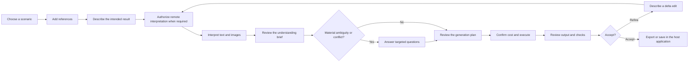

# Scenario and User Journey Design

[简体中文](zh-CN/scenario-design.md)

**Status:** Proposed for v0.1

**Normative language:** English

**Scope:** Reference product journeys that an application can build with VOCE; this document does not prescribe a specific UI framework.

Terminology in this document follows the [project glossary](glossary.md). Stable scenario IDs are shared by the English and Chinese editions.

## 1. Purpose

VOCE is an infrastructure project, but its architecture must support a coherent human journey. This document defines that journey before implementation so the ontology and APIs do not expose internal complexity to creators.

The central user promise is:

> Upload references, describe the intended result, confirm what to preserve, replace, adjust, create, or remove, and exclude unwanted source evidence, then generate and refine with an explainable plan.

End users should never need to fill in an ontology form, assign one role to each image, edit provider prompts, or understand provider-specific fields.

## 2. Actors

### 2.1 Creator

A person using an application built on VOCE to create a try-on visualization, cosplay image, or product shot.

### 2.2 Reviewer

A creator, merchant, art director, or other person who confirms high-impact source bindings, conflicts, product fidelity, identity preservation, and output acceptance.

### 2.3 Integrator

A developer who embeds VOCE in an application, supplies storage and provider adapters, selects interaction mode, and maps application data to public contracts.

### 2.4 Rule-pack author

A domain expert or developer who contributes ontology vocabulary, constraints, interpretation scopes, prompt compilation, and semantic review criteria.

### 2.5 Operator

A person responsible for provider credentials, cost limits, retention, privacy policy, and asynchronous job infrastructure. VOCE defines boundaries but does not provide a hosted operator console in v0.1.

## 3. User-facing mental model

The application translates structured decisions into plain-language target actions and source exclusions:

| Decision | Layer | User meaning | Examples |
| --- | --- | --- | --- |
| Preserve | Target | Keep a selected property stable | identity, hairstyle, body proportions |
| Replace | Target | Use a different value or source for a property | dress, prop, background |
| Adjust | Target | Change selected dimensions of a property | softer smile, frontal pose, warmer light |
| Create | Target | Generate a property that has no selected source | rainy street, studio background, rim light |
| Remove | Target | Require an entity or property to be absent | earrings, handheld prop, visible text |
| Ignore as source | Source | Do not inherit a visible observation from a reference | original clothes, old background, unwanted jewelry evidence |

Target actions create `ChangeIntent` records. Source choices create `SourceBinding` records. They are not prompt shortcuts, and `Remove` is not interchangeable with `Ignore as source`.

## 4. Canonical creator journey (`SCN-001`)



### 4.1 Step 1 — Choose a scenario

The host application selects an initial rule-pack composition, interaction mode, and output preset. v0.1 reference scenarios are virtual try-on, cosplay, and product shot.

This choice supplies defaults; it must not prevent a later request from adding or removing supported concepts.

### 4.2 Step 2 — Add references

The creator uploads or selects one or more images. The application may optionally attach trusted catalog metadata or user annotations.

The system must not require one image to have one role. A single portrait may contain identity, hair, expression, pose, clothes, accessories, background, lighting, and camera evidence.

The application should show:

- a stable reference label such as `ref-01`;
- upload and analysis status;
- whether the source is user-provided, catalog-provided, or generated;
- a reminder that the creator must have the right to use the image.

### 4.3 Step 3 — Describe the intended result

The creator uses ordinary language, for example:

> Preserve my face and hairstyle, replace the original outfit with the dress in the second image, remove the original earrings, use a relaxed frontal pose, and create a light gray studio background.

Structured controls may supplement natural language, but they should map to the same intent contract.

Selecting `assisted` or `auto` mode is not blanket authorization for a remote call. Before any remote or fee-bearing Intent Interpreter or Reference Interpreter step, the host application discloses the service, data categories and destination, maximum calls, retention information when known, and estimated or bounded cost. A bounded interpretation authorization does not authorize image generation.

### 4.4 Step 4 — Interpret text and images

After any required interpretation authorization, the system requests only the interpretation scopes needed by the task. It does not exhaustively caption every image. Manual, fixture, and declared local interpreters do not require external-transmission authorization.

The Intent Interpreter derives structured change intent from user language. A model-backed Reference Interpreter produces only `Observation` records, unresolved items, and warnings; it does not propose, confirm, or reject a `SourceBinding`. The deterministic Evidence and Source Resolver combines change intent, observations, trusted metadata, prior decisions, and host policy to produce binding proposals and consequential questions.

The creator sees progress such as:

```text
Understanding the request
Analyzing relevant reference regions
Resolving source choices
Checking conflicts
```

The application must not claim that an uncertain model observation, a resolver-produced binding proposal, or an optimizer suggestion is a confirmed fact or decision.

### 4.5 Step 5 — Review the understanding brief

The system presents a compact, editable brief organized by target actions and source exclusions rather than by internal ontology paths.

Example:

```text
Preserve
- identity and facial features from ref-01
- hairstyle from ref-01

Replace
- dress from ref-02

Adjust
- expression: subtle smile
- pose: relaxed, front-facing stance

Create
- light gray studio background

Remove
- earrings from the result

Ignore as source
- original clothes, background, and pose observations from ref-01
```

Every visible item links to its evidence or user instruction. The creator can correct a source without rewriting the whole request.

The brief clearly marks proposed and confirmed items. An authorized `ObservationDecision` accepts or rejects an observation; an authorized `BindingDecision` accepts or rejects a resolver-produced binding proposal. Only observations and bindings with the required confirmed decisions may contribute facts to the `OntologyInstance`. Model confidence never substitutes for either decision.

### 4.6 Step 6 — Resolve only material questions

The system asks a question only when the answer changes a hard constraint, a high-impact source binding, expected cost, or the plausibility of the result.

Good questions:

- “Should the original pose be preserved or replaced?”
- “The long hair may cover the requested necklace. Move it behind the shoulders?”
- “The product has no back reference. Continue with front-view fidelity only?”
- “A full-face mask conflicts with strict identity visibility. Hold the mask, use a half mask, or relax identity mode?”

Poor questions:

- asking for every ontology field;
- asking the user to confirm low-impact defaults one at a time;
- asking for a provider parameter that the planner can derive;
- exposing raw model confidence without explaining its consequence.

Applications explain constraint importance in user language:

- `hard`: the current plan cannot waive or degrade it; changing it requires an explicit intent or policy revision and recompilation;
- `required`: it cannot be silently degraded; an authorized reviewer may issue a scoped waiver with a reason, after which the case is revised and recompiled;
- `preferred`: declared policy may degrade it without a separate waiver, but the plan must disclose what changed and why.

A waiver never changes model confidence, evidence provenance, or the original requirement record. It applies only to the identified case revision and constraint; it does not become a global default.

### 4.7 Step 7 — Review the generation plan

Before any remaining remote step in the compiled plan, the application presents a human summary:

- every external step and data destination, including remote Intent and Reference Interpreters, an LLM Prompt Optimizer, generator, postprocessor, Semantic Reviewer, and remote Asset Resolver or Asset Publisher;
- references selected and omitted, with reasons;
- unresolved limitations and review items;
- output size, format, and background contract;
- interpretation, optimization, generation, publication, postprocessing, review, validation, and cleanup steps that apply;
- maximum calls and cost caps per adapter;
- retry policy, timeout, cancellation limits, temporary-publication behavior, retention, and estimated or declared cost when available.

The creator confirms the plan, not the raw prompt. Advanced applications may expose Prompt IR and optimizer diffs separately.

Confirmation creates an `ExecutionAuthorization` bound to the exact case revision, `contextHash`, compiled deterministic signature, `PipelinePlan` hash, selected prompt-artifact hash, adapter/capability-profile digests, data-transfer digest, and budget digest. Changing any bound item invalidates the authorization and requires replanning and confirmation. Interpretation authorization, execution authorization, and permission to retry a retained artifact are separate grants.

### 4.8 Step 8 — Execute asynchronously

Long model calls must not depend on one browser request remaining open. A reference application should distinguish compilation from execution, for example:

```text
Compilation session
Interpreting references
Awaiting confirmation
Compiling constraints
Planning
Ready or blocked

Execution run
Queued
Generating source image
Postprocessing
Validating output
Needs review
Submission unknown — reconciliation required
Completed, technically failed, cancelled by request, or rejected in review
```

Closing the page does not imply cancellation. Cancellation behavior and whether a charged provider call can be stopped must be explicit.

`submission_unknown` is not presented as success, failure, or a reason to retry. The run is quarantined for human or provider reconciliation, with safe request and cost evidence when available. A replacement run requires a new explicit authorization. User cancellation and human rejection are recorded as distinct outcomes, not relabeled as technical failures.

### 4.9 Step 9 — Review output and checks

The result view separates three kinds of information:

1. technical facts, such as dimensions, format, Alpha, and file size;
2. model-assisted findings, such as possible identity or product-fidelity issues;
3. human review tasks that remain unverified.

The application must not present semantic fidelity as confirmed merely because the file contract passed.

The result also shows postprocessing and cleanup status. If source generation succeeded but postprocessing failed, the application discloses whether the source artifact was retained, its expiry and permitted use, and whether an explicitly authorized retry of only the failed step is possible. A cleanup failure remains visible as a privacy/retention action until cleanup succeeds or an operator resolves it; it does not trigger regeneration.

### 4.10 Step 10 — Refine by delta

The creator describes only the change:

> Replace the background with a snowy mountain and keep the person, expression, pose, clothes, and accessories unchanged.

The system creates a new revision that inherits explicitly preserved bindings and recompiles only affected decisions. It must not promise pixel-level immutability when the selected provider only supports full regeneration.

## 5. Reference semantics in the journey

### 5.1 Observation is not inheritance

If `ref-01` contains a person wearing a black jacket in a city, analysis may produce observations for identity, hair, expression, pose, jacket, background, lighting, and camera. A model-backed Reference Interpreter stops at those candidate observations. The Evidence and Source Resolver may then propose `SourceBinding` records, but a proposal is not inheritance. Only an authorized `ObservationDecision` and `BindingDecision` can admit the corresponding evidence and binding into the sparse `OntologyInstance`.

### 5.2 One reference, multiple bindings

```text
Proposed SourceBinding
person.identity  <- ref-01 preserve
person.hair      <- ref-01 preserve
pose             <- ref-03 inspire
wardrobe.top     <- ref-02 reproduce

ChangeIntent
expression       <- user instruction adjust
background       <- user instruction create
```

The source lines remain resolver proposals until their supporting observations and bindings receive the required decisions. The `ChangeIntent` lines describe the target and do not confirm a source.

### 5.3 One property, multiple evidence images

A garment may use a front image as its primary source, a back image for construction, and a detail image for a logo. The user sees one garment decision; the reference planner manages dependency and provider budget.

### 5.4 Corrections persist

When the creator corrects “use ref-02 for the jacket, not ref-03,” that correction becomes an explicit `BindingDecision` in the revision. Neither the Reference Interpreter nor the resolver may overwrite it silently during a later edit; a change requires a new authorized decision.

## 6. Scenario A — Commercial virtual try-on visualization (`VT-001`)

### 6.1 Goal

Create a visual merchandising or personal preview image that preserves selected person properties and renders selected garments or accessories from references.

It is not a physical fit, sizing, drape simulation, or purchase guarantee.

### 6.2 Typical inputs

- one portrait or full-body person reference;
- one or more product references;
- optional front, side, back, logo, hardware, material, or wearing-detail references;
- natural-language intent;
- optional trusted catalog metadata.

### 6.3 Example understanding brief

```text
Preserve: identity, hairstyle, body proportions from ref-01
Replace: original dress with product in ref-02
Adjust: front-facing full-body pose; move hair behind shoulders
Create: neutral studio background and soft commercial light
Remove: necklace from the result
Ignore as source: original clothing and room background observations from ref-01
Review: front design and logo fidelity; back design unavailable
```

### 6.4 Material conflicts

- long sleeves fully cover a required bracelet;
- hair covers requested earrings or necklace;
- a bag and jewelry require the same hand resource;
- a product-detail reference is present without its primary product reference;
- strict product color conflicts with a creative color-grade request;
- provider reference limits cannot retain all required sources.

### 6.5 Acceptance journey

The reviewer confirms identity resemblance and product fidelity separately. A successful structural validation does not complete those reviews automatically.

## 7. Scenario B — Cosplay creation (`CP-001`)

### 7.1 Identity modes

The application presents human language; the system maps it to policy:

| User option | Policy meaning |
| --- | --- |
| Still me | Strict identity preservation; recognizable face remains visible |
| Me portraying the character | Preserve recognizable identity while allowing declared hair, makeup, and styling changes |
| Full character transformation | Identity reference may guide pose or body presentation without requiring personal recognizability |

### 7.2 Typical inputs

- portrait or full-body subject reference;
- character design or costume composition reference;
- costume component details;
- wig, makeup, face-marking, mask, and prop references;
- optional pose and background references.

### 7.3 Example intent and source plan

```text
Proposed SourceBinding
identity          <- selfie preserve
hair and color    <- character reference reproduce
makeup            <- face detail reference reproduce
costume           <- costume references reproduce
prop              <- weapon reference reproduce

ChangeIntent
pose              <- user instruction adjust
background        <- user instruction create
```

### 7.4 Material conflicts

- a full-face mask conflicts with strict identity visibility;
- two-handed props conflict with hand jewelry or another held prop;
- a helmet conflicts with a required hairstyle display;
- a creative prompt attempts to override a hard costume detail;
- the request relies on a named character but supplies no lawful visual reference for exact reproduction.

The library provides source and constraint mechanics. The host application remains responsible for rights, policy, and moderation decisions.

## 8. Scenario C — Product-only shot (`PS-001`)

### 8.1 Purpose

Prove that the compiler, reference planner, prompt optimizer, pipeline planner, and evaluation runtime do not assume a person is present.

### 8.2 Typical journey

1. upload a product primary image and optional detail references;
2. request a composition, background, camera, lighting, and output format;
3. confirm product-preservation and background decisions;
4. inspect reference-budget and output-contract planning;
5. generate, validate, and review product fidelity.

### 8.3 Example

```text
Preserve: product shape, material, color, logo, and hardware
Adjust: three-quarter camera angle and soft side light
Create: dark stone tabletop with a restrained gradient background
Ignore as source: original packaging and source-image background observations
```

## 9. Iterative and conversational edits (`REV-001`)

Every accepted or generated revision becomes a new source context, not an invisible mutation. A revision records:

- parent revision;
- user delta intent;
- inherited, changed, and removed bindings;
- new observations, constraints, prompt changes, and execution plan;
- whether the provider supports a true edit or requires full regeneration.

Examples:

- “Make the smile less pronounced; keep everything else.”
- “Move the bag to the left shoulder so the bracelet is visible.”
- “Keep the product and camera; replace only the background.”

If “everything else” cannot be guaranteed, the application must state the limitation before execution.

`artifact replay` is available only while every host-owned artifact required by the replay remains available and permitted for use. If a required reference, generated source artifact, or receipt has been deleted or expired, the application reports replay as unavailable. It does not create placeholders, recover an expired temporary URL, or silently turn replay into a new paid call. A `live rerun` is a new `ExecutionRun` with a new plan and `ExecutionAuthorization`.

## 10. Interaction modes

### 10.1 `manual`

The application or user supplies `Observation` records and the authorized `ObservationDecision` and `BindingDecision` records required by policy. The deterministic resolver still produces any `SourceBinding` proposal before a binding decision refers to it. No interpretation model is required. This mode supports catalogs, privacy-sensitive deployments, and deterministic tests.

### 10.2 `assisted`

A model-backed Reference Interpreter produces only `Observation` records. The deterministic resolver produces `SourceBinding` proposals, and an authorized user or host policy records the required `ObservationDecision` and `BindingDecision` values. High-impact decisions remain user-confirmed. This is the recommended default for consumer-facing applications.

### 10.3 `auto`

The model still produces only observations. The deterministic resolver proposes bindings, and an authorized application policy may record decisions for declared low-risk cases. Low-confidence, identity, product-fidelity, rights, and hard-conflict cases still stop or produce a review task.

“Auto” means policy-controlled automation, not unrestricted model authority.

## 11. Failure and recovery journeys

| Condition | User-visible behavior | System behavior |
| --- | --- | --- |
| Image cannot be decoded | Identify the affected reference and supported formats | Stop interpretation for that asset; do not create an empty observation |
| Analysis confidence is insufficient | Ask one consequential question or offer manual annotation | Preserve unknown state; do not invent a fact |
| Hard constraints conflict | Explain the conflict and offer valid resolutions | Block generation; record a minimal conflict set |
| Provider cannot satisfy output | Explain the capability gap and possible pipeline or provider alternatives | Fail before the affected generation or postprocessing call; retain earlier authorized interpretation receipts |
| Required reference exceeds budget | Explain which dependency makes the plan impossible | Do not silently omit or reorder the reference |
| Browser or proxy times out | Show that the job continues and allow status recovery | Continue in the job runtime; avoid duplicate submission |
| Worker restarts after a paid call may have begun | Show `submission_unknown` and a reconciliation task | Quarantine the run; reconcile provider/request evidence; never retry automatically |
| User requests cancellation | Show whether cancellation is pending, accepted, or no longer safe | Cancel only when the adapter can honor it; record cancellation separately from technical failure |
| Human reviewer rejects an output | Show a review rejection and its reason | Preserve the review decision; do not classify it as provider or validation failure and do not regenerate automatically |
| Postprocessing fails after source generation | Show whether the source artifact is retained, usable, and when it expires | Preserve it only under host policy; retry only the failed step with explicit authorization and a still-valid artifact |
| Temporary-asset cleanup fails | Show cleanup pending as a privacy/retention warning | Retry cleanup within policy, alert the operator, and retain receipts; do not regenerate the image |
| Output file is invalid | Report technical validation failure | Keep diagnostic receipts; do not claim semantic failure |
| Semantic fidelity is uncertain | Present a review task | Do not convert model confidence into a confirmed pass |
| Required replay artifact was deleted or expired | Report `artifact replay` as unavailable | Do not create a placeholder, recover an expired URL, or submit a new call without a new plan and authorization |
| Moderation or rights policy blocks execution | Give a safe, non-sensitive explanation | Do not rewrite the request to bypass policy |

## 12. Privacy and cost checkpoints

Before the first external transmission, a host application must disclose and obtain the appropriate bounded authorization for every applicable remote component: Intent Interpreter, Reference Interpreter, LLM Prompt Optimizer, generator, postprocessor, Semantic Reviewer, Asset Resolver, and Asset Publisher. The disclosure identifies the service, region when known, transmitted data categories, destination, purpose, retention information when available, maximum calls, retries, cancellation limits, and estimated or capped cost. It must provide a path to manual mode when its product promises local or model-free interpretation.

Authorization is progressive rather than blanket. A bounded interpretation authorization covers only its declared interpreter steps. The later `ExecutionAuthorization` binds the exact revision, context, deterministic signature, plan, selected prompt artifact, adapter/capability profiles, data-transfer declaration, and budget by hash or digest. Any bound input change invalidates it before another external call.

The plan confirmation and later run view should make visible:

- all applicable remote components and their data destinations;
- authorization scope, maximum calls, retries, and cost caps per adapter;
- expected retention, temporary publication, expiry, and cleanup behavior;
- estimated and actual cost as separate values when the adapter can provide them;
- cancellation, reconciliation, retained-artifact retry, and replay limitations.

VOCE traces use IDs, hashes, safe summaries, and redacted receipts by default. They must not include image bytes, Base64 data, secrets, signed URLs, or unrestricted biometric descriptions.

## 13. Integrator journey (`DEV-001`)

1. install the SDK and run offline examples;
2. select rule packs and an interaction mode;
3. map application assets and metadata to VOCE contracts;
4. use manual or fixture interpreters first;
5. run `compile`, `explain`, and Mock execution without network calls;
6. inspect observations, observation and binding decisions, ontology, conflicts, prompt coverage, and plan receipts;
7. add explicit interpreter, optimizer, provider, storage, asset resolver/publisher, postprocessor, validator, and semantic-reviewer adapters;
8. configure budgets, retention, redaction, moderation, and review policy;
9. validate representative scenarios before enabling real calls;
10. expose only the understanding brief and material decisions to creators.

## 14. Rule-pack author journey (`RPK-001`)

1. define or reuse ontology vocabulary;
2. define interpretation scopes rather than a full-image caption prompt;
3. add deterministic constraints and explanation text;
4. define prompt sections and semantic review criteria;
5. create positive, conflict, unknown, and provider-budget fixtures;
6. verify deterministic signatures and bilingual user explanations where supplied;
7. document what the pack can and cannot claim.

## 15. Scenario acceptance criteria for v0.1

The v0.1 scenario layer is acceptable when:

1. a creator can complete each reference scenario without seeing ontology paths or provider parameters;
2. one reference can support multiple observations and resolver-produced binding proposals, while model output itself contains no binding decision;
3. only observations and bindings with authorized `ObservationDecision` and `BindingDecision` records enter the `OntologyInstance`;
4. the understanding brief distinguishes preserve, replace, adjust, create, remove, and ignore-as-source decisions;
5. only material ambiguity produces a user question;
6. `hard`, `required`, and `preferred` constraints have visible degradation and waiver boundaries;
7. conflicts and provider gaps are explained before the affected generation or postprocessing step;
8. every first external transmission is covered by bounded disclosure and authorization, and `ExecutionAuthorization` becomes invalid when a bound plan item changes;
9. `submission_unknown` leads to reconciliation rather than a terminal success/failure claim or automatic retry;
10. cancellation, human rejection, technical failure, postprocessing failure, and cleanup failure remain distinct outcomes with appropriate recovery paths;
11. revisions preserve explicit corrections and show whether an edit or regeneration is planned;
12. `artifact replay` reports unavailable when a required host artifact has been deleted or expired;
13. technical validation, model-assisted findings, and human review remain distinct;
14. manual mode completes compilation and Mock execution without a model or network call;
15. the full workflow can be implemented by a host application without adopting private product concepts.
