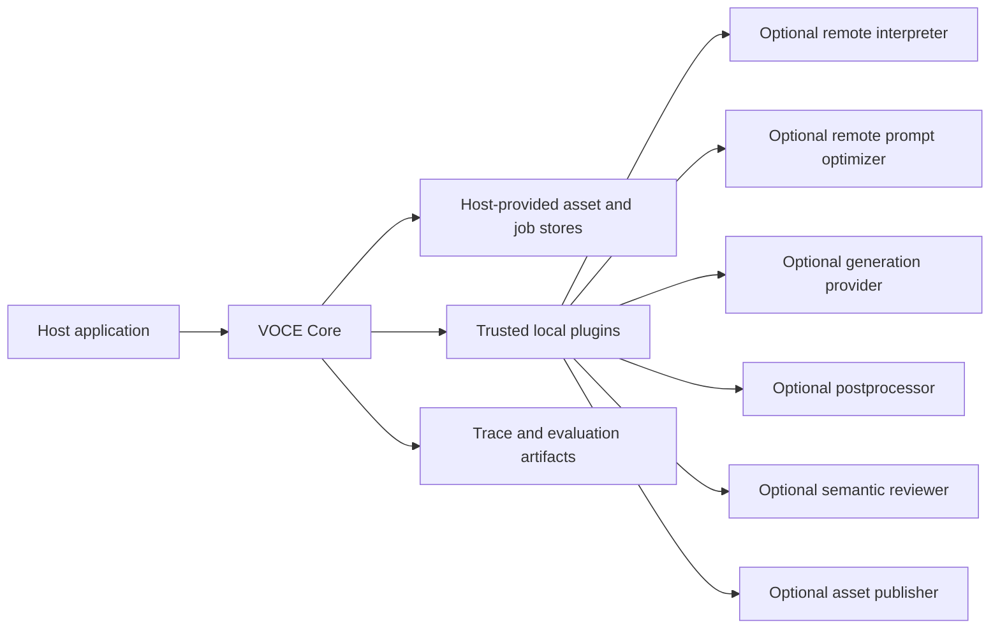
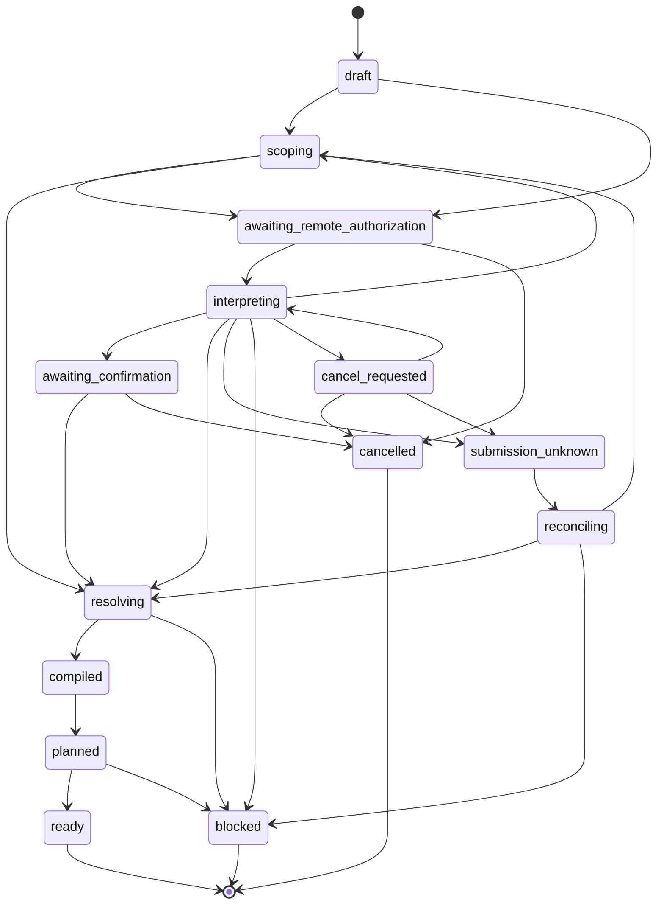
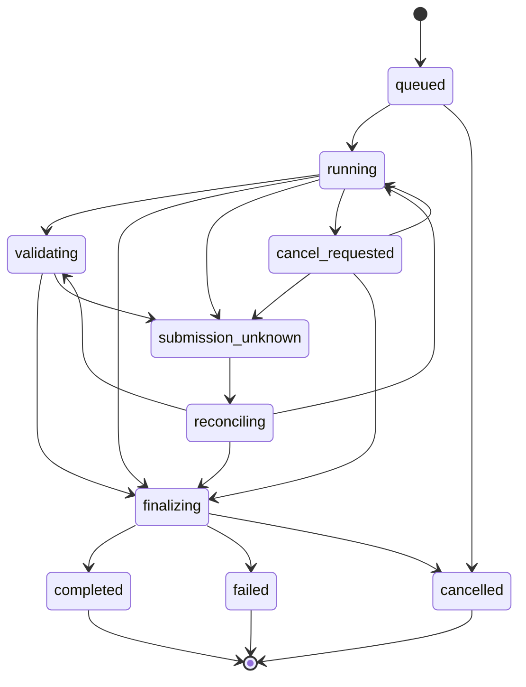

# System Design

[简体中文](zh-CN/system-design.md)

**Status:** Proposed for v0.1

**Normative language:** English

**System name:** Visual Ontology & Constraint Engine (VOCE)

Terminology in this document follows the [project glossary](glossary.md).

## 1. Purpose

VOCE converts natural-language intent, reference images, trusted metadata, and domain rules into an executable, explainable, and replayable plan for reference-guided image generation.

The system addresses a semantic orchestration problem rather than a transport problem. Its responsibility is to determine:

- what the user wants to preserve, replace, adjust, create, or remove;
- what each reference may provide to the current task;
- which observations are accepted, rejected, or unresolved;
- which constraints conflict before a paid generation call;
- which references fit a provider's limits without breaking dependencies;
- whether an output contract is directly or indirectly reachable;
- how a provider-neutral prompt is optimized without losing hard constraints;
- what can be validated automatically and what still requires human review.

## 2. Goals and non-goals

### 2.1 Goals

- Provide a domain-rich visual ontology whose task instances remain sparse and evidence-backed.
- Support one reference image contributing evidence to multiple ontology scopes.
- Separate probabilistic interpretation from deterministic acceptance, compilation, and planning.
- Keep user change intent separate from evidence-source relationships.
- Produce deterministic intermediate artifacts, traces, and plan signatures from confirmed inputs.
- Plan around provider capabilities, data reachability, cost, timeout, and output contracts before execution.
- Make prompt optimization inspectable through change sets and hard-constraint coverage.
- Support offline manual, fixture, compile, explain, Mock, replay, and comparison workflows.
- Provide extension ports for interpreters, rule packs, optimizers, providers, postprocessors, validators, reviewers, and asset publication.

### 2.2 Non-goals for v0.1

- A hosted SaaS, commercial creator interface, user account system, catalog, payment system, or publishing platform.
- Physical garment fit, sizing, drape simulation, or a real-world purchase guarantee.
- Face recognition, identity verification, or automatic claims that two photographs depict the same natural person.
- Multi-person identity association.
- Pixel-identical generation replay.
- A distributed multi-tenant queue or untrusted plugin sandbox.
- Automatic semantic scoring as the final arbiter of identity or product fidelity.
- Video generation or temporal consistency.
- A generic arbitrary-DAG workflow engine.

## 3. Design invariants

The following invariants are normative:

1. An `Observation` is a candidate claim, not an accepted fact.
2. Visible content in a reference is not inherited without an accepted source decision.
3. An image may supply multiple observations and source bindings.
4. Missing information remains unknown; the ontology is not filled for completeness.
5. User intent, evidence confidence, constraint importance, and decision status are separate dimensions.
6. Probabilistic components may propose; deterministic policy or an authorized person accepts.
7. Rule packs are deterministic and do not perform network calls.
8. Provider adapters execute approved plans; they do not change semantic intent or add calls.
9. Prompt coverage does not prove that a generation model obeyed the prompt.
10. Structural validation does not prove semantic fidelity.
11. A potentially charged submission with an unknown outcome is never retried automatically.
12. Standard tests, CI, and examples perform no paid calls.
13. Public traces exclude secrets, image bytes, Base64 payloads, signed URLs, and unrestricted sensitive descriptions.
14. Every remote call is preflighted, explicitly authorized, budgeted, and recorded through a durable run and redacted events.
15. Changing a case revision, compilation signature, plan hash, adapter, destination, input hash, or budget invalidates the corresponding authorization.
16. The deterministic Prompt Guard proves only typed structural invariants; unverifiable language is never treated as proven-safe.
17. Human acceptance is independent from technical execution and probabilistic semantic review.

## 4. System context and trust boundary



The host application owns authentication, user consent, asset rights, persistence, retention, deletion, moderation policy, credentials, cost authorization, and user interface. VOCE owns public semantic contracts, deterministic compilation, plan validation, safe execution boundaries, and portable evaluation artifacts.

v0.1 plugins are trusted local code running in the host process. A plugin manifest discloses network access, possible fees, data destinations, input/output schemas, compatibility, and redaction behavior. Process isolation and a public plugin marketplace are deferred.

## 5. Core terminology

| Term | Definition |
| --- | --- |
| `CaseSpec` | Normalized user request, assets, mode, policies, and desired output for one design session |
| `CompilationContext` | Immutable versions, capability snapshots, allowed adapters, destinations, and budgets used to compile and sign a case revision |
| `ChangeIntent` | A requested result change: preserve, replace, adjust, create, or remove |
| `RequestedScopePlan` | Ontology scopes that interpreters are permitted and required to analyze for this task |
| `Observation` | A model-, metadata-, or user-proposed claim about an asset, with provenance and uncertainty |
| `ObservationDecision` | Separate, auditable acceptance or rejection of an observation by an authorized authority |
| `SourceBinding` | A decision that an ontology path may preserve, reproduce, be inspired by, or exclude selected evidence |
| `BindingDecision` | Proposed, confirmed, or rejected status and the authority responsible for it |
| `OntologyInstance` | Sparse set of accepted, relevant, provenance-bearing facts for compilation |
| `ConstraintIR` | Provider-neutral constraints, goals, conflicts, dependencies, resources, and explanations |
| `ReferencePlan` | Selected, ordered, omitted, and blocked references under dependencies and capability budgets |
| `PipelinePlan` | Approved bounded steps that can satisfy the requested output contract |
| `PromptIR` | Provider-neutral structured prompt sections linked to constraints and evidence |
| `PromptCandidateIR` | Typed, source-linked transformations proposed against a specific `PromptIR` signature |
| `RemoteCallAuthorization` | Immutable authority for a named remote step, input hash, adapter, destination, and bounded calls/cost |
| `ExecutionAuthorization` | Immutable authority bound to one case revision, compilation signature, and exact `PipelinePlan` hash |
| `ExecutionRun` | One approved attempt to execute a compiled plan |
| `StepReceipt` | Redacted projection of append-only events and evidence for one execution step |
| `ArtifactHandle` | Redacted host-owned reference to stored content and its availability, never the content bytes or an expiring URL |
| `EvaluationReport` | Structural results, probabilistic semantic findings, and human review decisions |

## 6. Data model

### 6.1 CaseSpec

```ts
interface CaseSpec {
  id: string
  revision: number
  mode: 'manual' | 'assisted' | 'auto'
  userIntent: string
  assets: ReferenceAsset[]
  trustedMetadata: TrustedMetadata[]
  policies: CasePolicies
  requestedOutput: OutputContract
}
```

`CaseSpec` is a design input, not authorization to call external services. Interpretation and generation authorization are separate.

### 6.2 CompilationContext

Planning depends on more than `CaseSpec`. A complete compilation receives an immutable, explicitly selected environment:

```ts
interface VersionPin {
  id: string
  version: string
  digest: string
}

interface AdapterBudget {
  adapterId: string
  stepKinds: string[]
  maximumCalls: number
  maximumRetries: number
  timeoutMs: number
  maximumCost?: MoneyLimit
}

interface DataTransferDeclaration {
  adapterId: string
  destination: string
  region?: string
  dataCategories: string[]
  purpose: string
}

interface CompilationContext {
  ontologySchema: VersionPin
  rulePacks: VersionPin[]
  hostPolicy: VersionPin
  adapters: VersionPin[]
  capabilityProfiles: VersionPin[]
  selectedGenerationProfileId: string
  optimizerMode: 'strict' | 'balanced' | 'creative'
  budgets: AdapterBudget[]
  dataTransfers: DataTransferDeclaration[]
  contextHash: string
}
```

The context pins every rule, policy, adapter, optimizer, and capability input that can change a deterministic result. Installing another plugin or refreshing a capability profile never changes an existing context silently.

`contextHash` is computed from the other context fields and never includes itself. Deterministic signatures use a canonical semantic projection of `CaseSpec`, confirmed decisions, and the referenced `CompilationContext`. Timestamps, run IDs, availability probes, receipt fields, and other volatile values are excluded.

### 6.3 ChangeIntent and importance

```ts
interface ChangeIntent {
  id: string
  operation: 'preserve' | 'replace' | 'adjust' | 'create' | 'remove'
  targetPath: string
  requestedValue?: unknown
  sourceHintIds?: string[]
  importance: 'hard' | 'required' | 'preferred'
  provenance: Provenance
}
```

`remove` means the target result must not contain an entity or property. It is different from excluding a source observation. For example:

```text
ChangeIntent remove accessories.earrings
SourceBinding exclude ref-01/accessories.earrings
```

The first constrains the output; the second prevents one reference from supplying the property.

Importance has normative execution semantics:

- `hard`: unsatisfied or conflicting means execution is blocked; it cannot be waived in place;
- `required`: unsatisfied means execution is blocked until an authorized person creates an explicit waiver or changed requirement in a new case revision;
- `preferred`: deterministic policy may degrade it, but must record the reason, affected goal, and rule trace.

Confidence never changes importance. A waiver never mutates the original requirement.

### 6.4 RequestedScopePlan

The Intent Interpreter runs before detailed visual interpretation. It derives the minimum relevant scopes from the user request, scenario policy, asset hints, and output contract.

```ts
interface RequestedScopePlan {
  scopes: Array<{
    ontologyPath: string
    assetIds: string[]
    purpose: 'resolve_change' | 'find_source' | 'detect_conflict' | 'validate_dependency'
    required: boolean
  }>
  excludedScopes: string[]
  questions: ClarificationQuestion[]
}
```

Metadata inspection may run in parallel, but expensive visual analysis is constrained by this plan. This prevents exhaustive, privacy-invasive image captioning.

### 6.5 ArtifactHandle and EvidenceRegion

Sensitive content remains in host-owned storage:

```ts
interface ArtifactHandle {
  id: string
  storeId: string
  contentHash: string
  mediaType: string
  byteLength?: number
  availability: 'available' | 'deleted' | 'expired' | 'unknown'
  retentionExpiresAt?: string
}

type EvidenceRegion =
  | { kind: 'rectangle'; x: number; y: number; width: number; height: number }
  | { kind: 'polygon'; points: Array<{ x: number; y: number }> }
  | { kind: 'mask'; maskArtifactId: string }
```

Coordinates are normalized. Public traces contain the safe handle and content hash, not bytes, Base64, storage credentials, or an expiring URL. A mask handle follows the same retention and disclosure rules as any other sensitive artifact.

### 6.6 Observation and ObservationDecision

```ts
interface Observation {
  id: string
  contentHash: string
  assetId: string
  ontologyPath: string
  value: unknown
  confidence?: number
  evidenceRegion?: EvidenceRegion
  provenance: Provenance
  analyzer?: {
    adapterId: string
    model: string
    promptVersion: string
  }
  warnings: string[]
}

interface ObservationDecision {
  observationId: string
  observationHash: string
  status: 'confirmed' | 'rejected'
  authority: 'user' | 'host_policy' | 'trusted_metadata' | 'auto_policy'
  decidedBy: string
  policyVersion?: string
  decidedAt: string
  reasonCode: string
}
```

Three independent axes must never be collapsed:

- `confidence`: epistemic uncertainty about an observation;
- `importance`: how strongly the user requires a result property;
- `decisionStatus`: whether a separate authorized decision accepted the candidate.

A high-confidence observation is not automatically a hard constraint. A hard user request does not prove an image observation is correct.

`Observation` is immutable candidate evidence. Its `contentHash` is computed from the canonical observation payload and excludes decisions. An analyzer cannot mark its own output confirmed. Confirmation or rejection is recorded in an `ObservationDecision` bound to that exact `observationHash`, with authority, reason, and policy version where applicable. Changing the candidate creates a new hash and invalidates the old decision.

### 6.7 SourceBinding and BindingDecision

```ts
interface SourceBinding {
  id: string
  targetPath: string
  observationIds: string[]
  relation: 'preserve' | 'reproduce' | 'inspire' | 'exclude'
  priority: 'hard' | 'required' | 'preferred'
}

interface BindingDecision {
  bindingId: string
  status: 'proposed' | 'confirmed' | 'rejected'
  authority: 'user' | 'host_policy' | 'trusted_metadata' | 'auto_policy'
  decidedBy: string
  policyVersion?: string
  decidedAt?: string
  reasonCode: string
}
```

`replace` is a change operation; `reproduce` is a source relationship. A request can replace an original jacket and reproduce the replacement from `ref-02`.

Only a confirmed `BindingDecision` may admit a binding into `OntologyInstance`. Confirming an observation means accepting the candidate claim; confirming a binding separately decides whether that evidence may supply the target.

### 6.8 Sparse OntologyInstance

```ts
interface OntologyFact {
  path: string
  value: unknown
  provenance: Provenance
  acceptedBy: string
  sourceBindingIds: string[]
}

interface OntologyInstance {
  schemaVersion: string
  facts: OntologyFact[]
  unknownPaths: string[]
  unresolvedItems: UnresolvedItem[]
}
```

The vocabulary can express person appearance, expression, gaze, pose, wardrobe, accessories, props, environment, camera, lighting, style, references, and output. A task instance contains only accepted facts required for the current plan.

### 6.9 Provenance

```ts
interface Provenance {
  source:
    | 'user_explicit'
    | 'user_confirmed'
    | 'trusted_metadata'
    | 'reference_observed'
    | 'rule_inferred'
    | 'optimizer_suggested'
    | 'declared_default'
  sourceIds: string[]
  createdBy: string
  createdAt: string
}
```

Acceptance precedence is:

```text
user confirmation
> explicit user intent
> trusted structured metadata
> confirmed image observation
> deterministic rule inference
> model suggestion
> declared default
```

Precedence selects authority; it does not erase disagreements. Conflicts remain in the decision trace.

### 6.10 Remote and execution authorization

Every remote or potentially fee-bearing call is authorized against immutable inputs before a durable run is queued:

```ts
interface RemoteCallAuthorization {
  id: string
  caseId: string
  caseRevision: number
  contextHash: string
  stepId: string
  purpose:
    | 'intent_interpretation'
    | 'reference_interpretation'
    | 'prompt_optimization'
    | 'generation'
    | 'postprocessing'
    | 'semantic_review'
    | 'asset_publication'
  inputHash: string
  adapterId: string
  adapterDigest: string
  destination: string
  region?: string
  dataCategories: string[]
  maximumCalls: number
  maximumRetries: number
  maximumBytes?: number
  timeoutMs: number
  maximumCost?: MoneyLimit
  idempotencyKey: string
  authorizedBy: string
  authorizedAt: string
  expiresAt?: string
}

interface ExecutionAuthorization {
  id: string
  caseId: string
  caseRevision: number
  contextHash: string
  compilationSignature: string
  pipelinePlanHash: string
  promptArtifactHash: string
  adapterProfileDigests: string[]
  dataTransferDigest: string
  budgetDigest: string
  remoteCallAuthorizationIds: string[]
  authorizedBy: string
  authorizedAt: string
  expiresAt?: string
}

interface RemoteCallRun {
  id: string
  authorizationId: string
  inputHash: string
  state:
    | 'queued'
    | 'running'
    | 'cancel_requested'
    | 'submission_unknown'
    | 'reconciling'
    | 'succeeded'
    | 'failed'
    | 'cancelled'
  stepReceiptId: string
}
```

A context, plan, prompt artifact, adapter/profile digest, destination declaration, input hash, or budget change invalidates the applicable authorization. Authorization is never inferred from credentials being present. A retry that creates another remote submission requires remaining explicit retry authority and is forbidden while the previous submission outcome is unknown.

## 7. Visual ontology modules

The public vocabulary is modular:

- `person`: task-level subject continuity, appearance, face, skin, hair, and transformable regions;
- `expression`: emotion, intensity, eyes, brows, mouth, gaze, and head angle;
- `pose`: body orientation, limbs, hands, fingers, weight, action, and shared/exclusive resources;
- `wardrobe`: slots, layers, coverage, silhouette, material, color, and product fidelity;
- `accessory`: placement region, side, visibility, occlusion, and detail evidence;
- `prop`: held, worn, carried, or placed objects and resource claims;
- `environment`: transparent, solid, studio, or scene background, location, time, weather, and depth layers;
- `camera`: framing, view, angle, lens expression, crop, composition, and depth of field;
- `lighting`: key, fill, rim, direction, softness, temperature, and atmosphere;
- `style`: rendering treatment, color treatment, and texture that cannot override hard identity or fidelity requirements;
- `output`: dimensions, aspect, format, Alpha, background, byte limits, and downstream use.

“Person identity” means continuity of recognizable appearance within the task. It does not mean legal identity, biometric verification, face matching, or automatic cross-image person association.

## 8. Interpretation pipeline

### 8.1 Intent Interpreter

Consumes normalized user text and scenario context. Produces `ChangeIntent`, `RequestedScopePlan`, ambiguities, and unsafe or unsupported requests. It does not create accepted ontology facts.

The default manual/fixture path derives the scope plan offline. If a host selects a remote Intent Interpreter, text transmission requires a `RemoteCallAuthorization` based on its manifest before the call; it cannot wait for the later generation plan.

### 8.2 Reference Interpreter

Consumes only assets and scopes allowed by `RequestedScopePlan`. Produces `Observation` records, unresolved items, and warnings.

A remote Reference Interpreter is preflighted after scope planning. Its exact asset hashes, scopes, destination, call/cost bounds, and adapter digest are bound into `RemoteCallAuthorization`; the call runs as a durable `RemoteCallRun` with redacted step events.

It must:

- allow multiple observations per asset;
- return strict schema output;
- identify evidence regions where practical;
- record adapter, model, and prompt version;
- treat image text as observed content, never as system instructions;
- avoid biometric identity claims;
- avoid promoting logo, material, or identity guesses to confirmed facts.

### 8.3 Evidence and Source Resolver

Deterministically combines `ChangeIntent`, observations, trusted metadata, prior confirmed decisions, and host policy. It produces:

```text
OntologyInstance
accepted SourceBindings
ObservationDecisions
BindingDecisions
clarification questions
blocking conflicts
unresolved items
decision trace
```

It may ask a question only if the answer affects a hard/high-impact binding, conflict, output feasibility, external data transfer, or material cost.

### 8.4 Interaction modes

All modes converge on the same resolver and ontology contracts:

- `manual`: the host or user supplies observations plus explicit observation and binding decisions; no interpretation model call;
- `assisted`: models propose observations, the resolver produces binding proposals, and high-impact or low-confidence decisions await confirmation;
- `auto`: policy may accept low-risk candidates, but identity, product-fidelity, rights, and hard-conflict gates remain.

`auto` is experimental policy-controlled automation, not unrestricted model authority.

## 9. Constraint compilation

The Constraint Graph Compiler converts accepted ontology facts, change intent, source bindings, output requirements, and rule packs into `ConstraintIR`.

Constraint types include:

- preservation and transformation;
- visibility and minimum evidence;
- coverage and occlusion;
- spatial placement and composition;
- mutual exclusion and compatibility;
- dependency and cardinality;
- shared and exclusive resource claims;
- provider and output requirements;
- semantic review requirements.

Output:

```ts
interface ConstraintIR {
  constraints: Constraint[]
  goals: Goal[]
  conflicts: Conflict[]
  degradedPreferences: Degradation[]
  manualReviewTasks: ReviewTask[]
  ruleTrace: RuleTrace[]
  deterministicSignature: string
}
```

The compiler returns a minimal explainable conflict set when a `hard` conflict blocks generation. An unsatisfied `required` constraint also blocks execution until a new revision contains an explicit authorized waiver; only `preferred` constraints may be degraded automatically with trace. The compiler does not call a model.

Rule packs are versioned, deterministic, side-effect-free modules. They may introduce ontology vocabulary, interpretation scopes, constraints, prompt sections, explanations, and semantic-review templates.

## 10. Reference planning

The Reference Budget Optimizer selects provider inputs without breaking semantic dependencies.

Inputs:

- confirmed observation and binding decisions plus their dependencies;
- normative `hard`, `required`, and `preferred` importance;
- parent-child relationships, such as product primary/detail references;
- pinned information-coverage and duplication signals;
- the selected, version-pinned provider profile's count, per-image byte, total byte, format, and ordering limits.

Outputs:

- selected references and assigned stable labels;
- omitted references with reason codes;
- blocked required references;
- total budget use;
- dependency and ordering trace.

The optimizer may omit only `preferred` evidence according to declared policy. Unsatisfied `hard` or `required` evidence blocks the plan; `required` can proceed only after an explicit waiver creates a new case revision. The optimizer may not retain a detail without its parent, use a product-wearing example as a person-identity source, or reorder inputs after prompt compilation.

## 11. Capability and pipeline planning

A `ProviderCapabilityProfile` describes observed or contractually declared capability, including:

- input modalities and source types;
- reference count, size, ordering, and dependency behavior;
- prompt and output limits;
- dimensions, formats, Alpha, and background support;
- generation/edit capabilities;
- timeout and streaming behavior;
- known incompatibilities;
- verification status and evidence date.

The Capability-aware Pipeline Planner matches the target `OutputContract` to registered steps. A plan may include:

```text
resolve provider-readable assets
generate source image
publish a short-lived signed asset when required
remove background
normalize canvas
validate structure
prepare semantic review
run mandatory temporary-asset cleanup
```

The planner produces a bounded acyclic primary plan plus explicit finally/compensation obligations. Every adapter step declares maximum calls, retries, timeout, maximum cost when known, data categories, destination, and whether it may create a charged submission. Cleanup steps declare `always`, `on_success`, or `on_failure_or_cancel` conditions and run after success, failure, cancellation, or an uncertain submission whenever safe.

`PipelinePlan` has a canonical hash over its steps, dependencies, conditions, adapter/profile digests, budgets, data transfers, and cleanup obligations. A plan is executable only under an `ExecutionAuthorization` containing that exact hash.

If the contract is unreachable, planning fails before any generation or postprocessing call governed by that plan. Earlier authorized interpretation receipts remain truthful history. Adapters cannot claim capabilities not present in the selected profile.

## 12. Prompt compilation and optimization

### 12.1 PromptIR

The deterministic Prompt Compiler converts accepted facts and constraints into provider-neutral structured sections:

```ts
interface PromptIR {
  sections: Array<{
    id: string
    priority: number
    content: string
    constraintIds: string[]
    sourceIds: string[]
    mutability: 'locked' | 'rephraseable' | 'suggestion_slot'
  }>
  forbidden: PromptProhibition[]
  references: PlannedReference[]
  allowedParameters: ProviderParameterConstraint[]
  output: OutputContract
  deterministicSignature: string
}
```

Every hard constraint is represented by a `locked` section or a typed, validated request parameter. The deterministic renderer can produce a provider prompt directly from `PromptIR` without an LLM.

### 12.2 Prompt Optimizer and PromptCandidateIR

An optimizer does not return an unstructured replacement prompt as authority. It proposes typed transformations against an exact base signature:

```ts
type PromptTransformation =
  | { kind: 'rephrase'; sectionId: string; content: string }
  | { kind: 'reorder'; sectionIds: string[] }
  | { kind: 'omit_redundant'; sectionId: string; reasonCode: string }
  | { kind: 'set_parameter'; name: string; value: unknown }
  | {
      kind: 'add_suggestion'
      slotId: string
      content: string
      provenance: Provenance
    }

interface PromptCandidateIR {
  basePromptIRSignature: string
  transformations: PromptTransformation[]
  optimizer: VersionPin
  mode: 'strict' | 'balanced' | 'creative'
  warnings: string[]
}
```

Modes:

- `strict`: locked sections are unchanged, no suggestion is added, and only allowlisted parameterization or reordering is permitted;
- `balanced`: may propose camera, lighting, and composition only in declared suggestion slots with `optimizer_suggested` provenance;
- `creative`: may elaborate atmosphere and artistic treatment only in declared suggestion slots without changing locked sections, references, or output requirements.

The offline deterministic optimizer is the CI baseline. An LLM optimizer is optional, external, potentially paid, separately authorized by `RemoteCallAuthorization`, and executed as a durable remote step. Its output is schema-validated but not trusted merely because it supplies IDs.

### 12.3 Prompt Guard

The deterministic guard applies each transformation to `PromptIR` and proves only mechanically verifiable properties:

- the base signature matches;
- locked sections and hard-constraint parameters are unchanged;
- rephrases and omissions target only sections that permit them;
- reference IDs, order, source bindings, and output requirements remain approved;
- parameter changes satisfy typed allowlists;
- additions occur only in allowed suggestion slots and retain `optimizer_suggested` provenance.

Arbitrary free text, an unlinked section, or a transformation whose semantic safety cannot be proven is `unverifiable`. Policy must either route it to review or discard the candidate and render the deterministic `PromptIR` fallback. The guard does not claim to detect every semantic contradiction in arbitrary prose and does not prove model compliance.

Only a guarded candidate is rendered into the final provider prompt and typed request parameters. The rendered artifact, candidate, guard report, and deterministic fallback are stored separately.

If a provider returns a `providerRevisedPrompt`, VOCE records it as a separate provider artifact. It does not overwrite `PromptIR` or the optimizer result.

## 13. Lifecycle and state machines

Design/compilation, remote analysis calls, approved plan execution, and human acceptance are separate objects. Every remote call has a durable `RemoteCallRun` even when it occurs during compilation.

### 13.1 CompilationSession



States:

```text
draft
scoping
awaiting_remote_authorization
interpreting
awaiting_confirmation
resolving
compiled
planned
ready
blocked
cancel_requested
submission_unknown
reconciling
cancelled
```

`ready` means execution is feasible; it is not execution authorization. A remote intent/reference call projects its durable `RemoteCallRun` state into the session. `submission_unknown` is not terminal: reconciliation recovers the existing result or records a known blocked/cancelled outcome. Reconciliation never resubmits automatically.

### 13.2 ExecutionRun



An `ExecutionRun` is created only from an unexpired `ExecutionAuthorization` whose revision, context hash, compilation signature, plan hash, prompt artifact hash, adapter/profile digests, destinations, and budgets still match.

`submission_unknown` means a remote request may have been accepted or charged but the runtime did not receive a reliable acknowledgement. It always moves to explicit `reconciling` and is never retried automatically. Reconciliation may query an existing provider request, attach a recovered result, or establish a known failure; a new submission is a separately authorized run.

`cancel_requested` records intent, not a completed cancellation. If an adapter cannot safely stop an in-flight call, the run continues or becomes `submission_unknown`. `finalizing` executes required structural checks and all safe finally/compensation cleanup obligations before a terminal state.

VOCE does not claim exactly-once behavior for arbitrary external HTTP providers.

### 13.3 StepEvent and StepReceipt

```text
pending
authorized
submitted
acknowledged
succeeded
failed
cancel_requested
cancelled
skipped
cleanup_pending
cleaned
cleanup_failed
submission_unknown
reconciling
```

State changes are append-only `StepEvent` records. A `StepReceipt` is a redacted projection over those events, not a mutable history replacement. Every step has a deterministic local idempotency key, input hash summary, authorization ID, adapter/version, timestamps, safe provider request ID when available, output hash summary, failure code, actual cost evidence when available, and cleanup state.

`skipped` is valid only when a declared condition is not met or an upstream dependency prevents execution. A local idempotency key does not imply that an external provider supports exactly-once submission.

## 14. Execution runtime

The runtime executes only the exact `PipelinePlan` bound to a valid `ExecutionAuthorization` and enforces:

- per-adapter and per-step call, retry, timeout, and cost budgets for intent/reference interpreters, prompt optimizers, generators, postprocessors, semantic reviewers, asset publishers, and any other remote step;
- a retryable-code allowlist and a prohibition on retry while any prior submission is unknown;
- the authorized data categories and destination for every remote step;
- explicit timeout and cancellation behavior;
- step ordering and dependency completion;
- finally/compensation asset cleanup after success, failure, cancellation, or uncertain outcomes when safe;
- append-only redacted events and projected receipts;
- no hidden fallback provider;
- no automatic regeneration after semantic failure.

v0.1 may use a local persistent job log and one worker. Distributed queues, multi-tenancy, and global exactly-once delivery are deferred, but public ports must allow a host application to supply its own `JobStore` and `JobQueue`.

Client disconnection does not cancel a run. A cancellation request first enters `cancel_requested`; only a confirmed stop becomes `cancelled`. Otherwise the run continues or enters `submission_unknown` and reconciliation.

## 15. Validation and evaluation

Evaluation has three separate layers:

### 15.1 Deterministic structural validation

- media signature, decode, dimensions, format, Alpha, background, file size;
- reference and call budgets;
- planned-step completion and cleanup;
- artifact and receipt schema validity.

### 15.2 Probabilistic semantic review

A `SemanticReviewer` may produce findings with confidence, evidence, model/version, and warnings for identity continuity, product fidelity, visibility, composition, or other rule-pack criteria.

These findings are proposals, not final decisions.

A remote reviewer requires its own `RemoteCallAuthorization`, adapter/step budget, durable run, and redacted receipt. A review timeout or uncertain submission does not trigger another generation.

### 15.3 Human acceptance

A person may accept, reject, or annotate review tasks. Identity continuity, logo, material, physical plausibility, and artistic acceptability remain human-reviewable claims.

Human acceptance is stored separately from `ExecutionRun` as `pending`, `accepted`, `rejected`, or `waived`, with reviewer, timestamp, reason, and artifact hashes. A technically `completed` run may therefore still have pending or rejected human acceptance; rejection is not rewritten as an execution failure.

Real model outputs are not pixel-golden CI fixtures. CI validates expected ontology, constraints, reference plan, pipeline plan, Prompt Guard behavior, Mock receipts, and report schemas.

## 16. Revision, replay, and comparison

Each edit creates a new case revision and, if executed, a new run. It records parent IDs, delta intent, inherited/changed/removed bindings, new plans, and provider edit capability.

Replay has three meanings:

- `plan replay`: recompile confirmed inputs; deterministic IR, plans, and signatures should match for the same versions;
- `artifact replay`: resolve available host-owned `ArtifactHandle` records and reuse stored model artifacts without another paid call;
- `live rerun`: submit a new provider call; it is a new run and does not promise pixel-identical output.

Artifact replay is conditional on host retention. If a required handle is `deleted`, `expired`, `unknown`, or cannot be resolved, replay returns `ARTIFACT_UNAVAILABLE` with the affected safe IDs; it never substitutes another asset or implies recovery of deleted bytes.

Comparison reports diff ontology facts, source bindings, constraints, reference selection, Prompt IR, optimizer changes, pipeline steps, receipts, and evaluation results.

## 17. Plugin ports

v0.1 defines these public extension ports:

- `IntentInterpreter`
- `ReferenceInterpreter`
- `RulePack`
- `PromptOptimizer`
- `ProviderAdapter`
- `PostProcessor`
- `StructuralValidator`
- `SemanticReviewer`
- `AssetResolver`
- `AssetPublisher`
- `JobStore`
- `JobQueue`

Every plugin manifest declares:

- plugin and core compatibility versions;
- input and output schema versions;
- deterministic or probabilistic behavior;
- network access and data destinations;
- possible fee-bearing calls;
- supported cancellation and retry behavior;
- secret requirements;
- log-redaction policy.

Interpreters and optimizers propose artifacts; they cannot mutate confirmed facts. Rule packs are pure. Provider adapters cannot change approved reference order, required inputs, output contracts, or budgets.

Selecting a plugin snapshots its manifest digest into `CompilationContext` or the relevant authorization. Any plugin that performs remote work, including a semantic reviewer or asset publisher, runs through the same authorization, budget, event, receipt, unknown-submission, and reconciliation contracts as a generation adapter.

## 18. Security, privacy, and rights

### 18.1 Data minimization

- Analyze only scopes required by `RequestedScopePlan`.
- Do not record image bytes, Base64, embeddings, or unrestricted face descriptions in traces.
- Strip EXIF before external transmission unless explicitly required and disclosed.
- Store content hashes, dimensions, MIME type, safe IDs, and redacted summaries by default.
- Refer to retained sensitive content through host-owned `ArtifactHandle` records with explicit availability; traces never embed storage credentials or direct locators.
- Provide a minimal local run bundle and a separate explicitly shareable bundle.
- Do not collect telemetry by default.

### 18.2 External transmission

Before a remote call, the host application discloses service, region when known, data category, purpose, retention information available from the adapter, maximum calls, retries, cost, and cancellation limits. That disclosure is bound into `RemoteCallAuthorization` rather than treated as an informational screen only.

Temporary public assets use short-lived signed URLs, are never logged, are read-only, and produce append-only publication and cleanup events. Publication is a separately budgeted remote step; cleanup is a finally/compensation obligation. A cleanup failure is explicit and cannot be hidden by an otherwise valid output.

External URL resolution restricts protocols, redirects, DNS/IP targets, content types, and byte limits to reduce SSRF and resource-exhaustion risk.

### 18.3 Identity and rights

VOCE does not perform identity verification or person recognition. The host application is responsible for consent, rights to person images, product images, brands, character designs, and other protected material, plus moderation and applicable law.

Benchmark assets must be synthetic, original, public-domain, or explicitly licensed for redistribution, with provenance recorded.

### 18.4 Secrets

Secrets are injected at runtime and never accepted inside `CaseSpec`, plugin manifests, traces, fixtures, screenshots, or public reports. Missing credentials fail explicitly before job creation or submission.

## 19. Error and recovery model

Errors use stable English codes and safe user-facing messages. Categories include:

```text
INPUT_INVALID
INTERPRETATION_UNAVAILABLE
CONFIRMATION_REQUIRED
CONSTRAINT_CONFLICT
REFERENCE_BUDGET_UNSATISFIABLE
PROVIDER_CAPABILITY_UNSATISFIABLE
REMOTE_CALL_NOT_AUTHORIZED
EXECUTION_NOT_AUTHORIZED
EXECUTION_AUTHORIZATION_INVALID
REMOTE_SUBMISSION_UNKNOWN
PROMPT_CANDIDATE_UNVERIFIABLE
PROVIDER_FAILED
POSTPROCESSING_FAILED
STRUCTURAL_VALIDATION_FAILED
SEMANTIC_REVIEW_REQUIRED
ARTIFACT_UNAVAILABLE
CLEANUP_FAILED
```

No failure creates empty placeholder observations, silently weakens a hard or required constraint, changes providers, or resubmits a potentially charged request whose outcome is unknown.

If postprocessing fails after source generation succeeds, the source artifact and receipts may be retained under host policy through an `ArtifactHandle`. Retrying only the failed step requires a new plan or plan revision, a valid artifact availability check, and new authorizations bound to its exact hashes and budgets.

## 20. Cost authorization and receipts

Intent/reference interpretation, prompt optimization, generation, postprocessing, semantic review, and asset publication may each incur cost and external data transfer. Preflight and planning account for every remote adapter and step separately.

Before execution, the host application can present:

- offline and remote steps;
- maximum calls, retries, timeout, and cost per adapter and step;
- retries and stop conditions;
- estimated cost or declared maximum when available;
- timeout and cancellation limits;
- data categories, destinations, and temporary-publication/cleanup behavior.

The approved values are persisted in `RemoteCallAuthorization` and, for final plan execution, `ExecutionAuthorization`. Actual calls and provider-reported usage/cost are recorded as redacted receipts when available. An estimate is never rewritten as an actual cost.

## 21. Versioning and compatibility

These artifacts are versioned independently:

- ontology schema;
- `CompilationContext`, observation/binding decision, authorization, and `ArtifactHandle` contracts;
- rule packs;
- ConstraintIR, ReferencePlan, PipelinePlan, PromptIR, and PromptCandidateIR;
- plugin manifests and capability profiles;
- run, step-event, receipt, and human-acceptance schemas;
- evaluation report schema.

Semantic Versioning applies after the first public package release. A breaking public contract change requires a migration note, compatibility fixtures, and paired documentation updates.

Run artifacts pin all relevant versions so a report remains interpretable after the project evolves.

The paired core specifications are `scenario-design`, `system-design`, and `glossary`. English is normative and Simplified Chinese is maintained as a first-class semantic translation; stable scenario/requirement IDs, enums, and code identifiers remain synchronized. Architecture and roadmap documents are explanatory summaries and are not included in this paired-translation guarantee unless they are explicitly published as a pair.

## 22. v0.1 implementation boundary

### 22.1 Required

- zero or one primary person per case, with multiple garments, accessories, or props when a person is present;
- a sparse ontology, multi-scope observations, `ObservationDecision`, and confirmed binding decisions;
- immutable `CompilationContext`, `RemoteCallAuthorization`, and plan-bound `ExecutionAuthorization` contracts;
- complete manual and fixture modes;
- assisted mode with one optional multimodal adapter;
- experimental auto policy with non-bypassable high-impact gates;
- deterministic resolver, compiler, reference planner, pipeline planner, prompt compiler, and Prompt Guard;
- deterministic offline prompt optimizer plus one optional LLM optimizer that returns constrained `PromptCandidateIR`;
- Mock-first execution and optional Seedream/veImageX adapter implementations;
- local persistent asynchronous execution for every remote step, with durable events, reconciliation, compensation cleanup, and submission-unknown protection;
- CLI and a read-only local/static HTML trace report;
- one complete offline Mock virtual-try-on vertical case, offline cosplay conflict cases, and an offline product-only regression as release gates;
- redistributable fixtures and offline CI.

Real-adapter smoke tests are explicit, credentialed, non-CI workflows. They are not run by default and are not a default `v0.1.0` release gate. A release may publish dated smoke evidence, but the project does not claim production readiness from it.

### 22.2 Deferred

- multiple-person automatic association;
- physical fit and material simulation;
- identity recognition or verification;
- hosted multi-tenant infrastructure;
- distributed exactly-once execution;
- untrusted plugin isolation or marketplace;
- an interactive Trace Studio beyond the read-only HTML trace report;
- video generation;
- automated semantic review as final authority;
- pixel-identical replay across live model calls.

## 23. v0.1 acceptance matrix

| ID | Requirement |
| --- | --- |
| SYS-001 | The same confirmed inputs and immutable `CompilationContext` produce identical ontology, IR, plans, and canonical signatures; volatile timestamps and run/receipt IDs do not affect them. |
| SYS-002 | One image can produce multiple immutable observations, while only separately authorized `ObservationDecision` and `BindingDecision` records admit evidence into the ontology. |
| SYS-003 | Low-confidence model candidates never become hard facts solely because of confidence. |
| SYS-004 | Preserve/replace/adjust/create/remove intent remains distinct from preserve/reproduce/inspire/exclude source relations. |
| SYS-005 | Mask/identity, sleeve/bracelet, and hand/prop conflicts can be detected before a generation call. |
| SYS-006 | Reference-budget reduction retains hard/required parent-child dependencies, omits only policy-permitted preferred evidence, and explains every omission or blocking requirement. |
| SYS-007 | The Prompt Guard rejects an invalid base signature, any change to locked sections, references, bindings, output requirements, or typed parameter bounds; unverifiable free text is reviewed or discarded for the deterministic fallback. |
| SYS-008 | Capability planning derives bounded steps and finally/compensation cleanup when feasible, fails before the governed generation call when not feasible, and executes only under an authorization containing the exact plan hash. |
| SYS-009 | Every remote call has durable redacted events; client disconnection, cancellation, and worker recovery never automatically repeat an unknown potentially charged submission, and `submission_unknown` proceeds through reconciliation. |
| SYS-010 | Shareable traces contain no image bytes, Base64, secrets, signed URLs, storage credentials, or unrestricted sensitive descriptions; retained content is represented only by safe `ArtifactHandle` metadata. |
| SYS-011 | Product-only cases pass through the same compiler, planner, runtime, and evaluation with zero primary people and no implicit person assumption. |
| SYS-012 | Manual mode can compile, explain, plan, Mock-run, replay, and compare without network access or credentials. |
| SYS-013 | Technical execution/validation, probabilistic semantic findings, and human acceptance remain separate artifacts and state machines; human rejection is not rewritten as a technical failure. |
| SYS-014 | Every remote adapter step declares and enforces its destination, data categories, calls, retries, timeout, cost, cancellation, cleanup, and redaction policy through authorization and receipts. |
| SYS-015 | The paired English/Chinese scenario, system, and glossary specifications keep scenario IDs, requirement IDs, enums, and code identifiers synchronized, with English remaining normative. |
