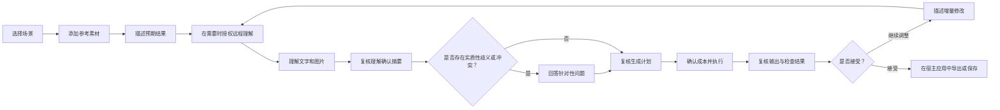

# 场景与用户旅程设计

[English normative source / 英文规范源](../scenario-design.md)

**状态：** v0.1 提案

**规范源语言：** English；英文版是本设计的规范源

**译文地位：** 本文是与英文规范源同步维护的一等简体中文译文；如出现歧义，以英文规范源为准，并应及时修正译文

**范围：** 宿主应用可以基于 VOCE 构建的参考产品旅程；本文不规定具体的 UI 框架。

本文采用[项目术语表](glossary.md)中的术语。英文版与中文版使用相同的稳定场景 ID。

## 1. 目的

VOCE 是一个基础设施项目，但它的架构必须支持连贯、易懂的用户旅程。本文在实现之前定义这条旅程，避免本体和 API 将内部复杂度暴露给创作者。

对用户的核心承诺是：

> 上传参考素材，描述预期结果，确认要保留、替换、调整、新建或移除的目标，并排除不应继承的来源证据，然后依据一份可解释的计划生成并逐步完善结果。

终端用户不应被要求填写本体表单、为每张图片指定唯一角色、编辑模型提供方的提示词，或理解提供方特有的字段。

## 2. 参与者

### 2.1 创作者（Creator）

使用基于 VOCE 构建的应用来制作试衣可视化、Cosplay 图片或商品图的人。

### 2.2 复核者（Reviewer）

对高影响来源绑定、冲突、商品还原保真度、人物身份保留和输出验收进行确认的创作者、商家、美术指导或其他人员。

### 2.3 集成者（Integrator）

将 VOCE 嵌入应用的开发者，负责提供存储和模型提供方适配器、选择交互模式，并将应用数据映射到公共契约。

### 2.4 规则包作者（Rule-pack author）

贡献本体词汇、约束、理解范围、提示词编译逻辑和语义复核标准的领域专家或开发者。

### 2.5 场景包作者（Scenario-pack author）

将可复用规则包、场景默认值、类型化宿主可覆盖点、用户界面元数据、Fixture、兼容性声明和迁移组合成可分发 `ScenarioPack`（场景包）的第三方开发者。

### 2.6 运行维护者（Operator）

负责模型提供方凭据、成本上限、数据保留、隐私政策和异步任务基础设施的人员。VOCE 会定义职责边界，但 v0.1 不提供托管式运维控制台。

## 3. 面向用户的心智模型

应用将结构化决策转换成面向用户的目标动作和来源排除：

| 决策 | 层级 | 用户含义 | 示例 |
| --- | --- | --- | --- |
| 保留（Preserve） | 目标 | 让选定属性保持稳定 | 人物身份特征、发型、身体比例 |
| 替换（Replace） | 目标 | 为某项属性采用不同的值或来源 | 连衣裙、道具、背景 |
| 调整（Adjust） | 目标 | 只改变某项属性的指定维度 | 更轻微的笑容、正面姿势、更温暖的光线 |
| 新建（Create） | 目标 | 生成没有选定来源的属性 | 雨夜街道、影棚背景、轮廓光 |
| 移除（Remove） | 目标 | 要求结果中不存在某个实体或属性 | 耳环、手持道具、可见文字 |
| 忽略为来源（Ignore as source） | 来源 | 不继承参考图中可见的某条观察项 | 原有衣服、旧背景、不需要的首饰证据 |

目标动作会创建 `ChangeIntent`，来源选择会创建 `SourceBinding`。它们都不是提示词快捷写法，`Remove` 也不能与 `Ignore as source` 互换。

## 4. 标准创作者旅程（`SCN-001`）



### 4.1 第 1 步——选择场景

宿主应用选择初始 `ScenarioPack`、交互模式和输出预设。商业虚拟试衣、Cosplay 和商品图是首发 `ScenarioPack` 示例实现。三个示例都使用相同的公共理解、裁决、编译、规划、执行和评测接口。

`VT-001`、`CP-001` 和 `PS-001` 等稳定文档 ID 只标识示例与验收叙事；VOCE Core 不识别这些 ID，也不会依据它们进行分支。Core 接收的是通过公共合同组装得到的 `EffectiveScenario`（有效场景定义）。

这一选择只提供默认值，不得阻止后续请求添加或移除系统支持的概念。

### 4.2 第 2 步——添加参考素材

创作者上传或选择一张或多张图片。应用也可以选择附加可信的商品目录元数据或用户标注。

系统不得要求一张图片只能承担一种角色。一张人物照片可以同时包含人物身份、头发、表情、姿势、衣着、饰品、背景、灯光和镜头方面的证据。

应用应显示：

- 稳定的参考素材标签，例如 `ref-01`；
- 上传和分析状态；
- 素材是由用户提供、商品目录提供，还是由系统生成；
- 提醒创作者必须拥有使用该图片的权利。

### 4.3 第 3 步——描述预期结果

创作者使用自然语言，例如：

> 保留我的脸和发型，用第二张图中的连衣裙替换原来的衣服，移除原来的耳环，采用放松的正面姿势，并新建浅灰色影棚背景。

结构化控件可以补充自然语言，但它们应映射到同一份意图契约。

选择 `assisted` 或 `auto` 模式，不代表用户已经概括授权所有远程调用。在调用任何远程或可能计费的 Intent Interpreter（意图理解器）或 Reference Interpreter（参考图理解器）之前，宿主应用必须披露服务、数据类别与目的地、最大调用次数、可获得的数据保留信息，以及预估或有上限的成本。具有明确范围的理解授权不等于授权图像生成。

### 4.4 第 4 步——理解文字和图片

在取得任何必要的理解授权之后，系统只请求当前任务所需的理解范围，不对每张图片做穷尽式描述。`manual`、fixture 和已声明的本地理解器不需要外部传输授权。

意图理解器（Intent Interpreter）根据用户语言推导结构化变更意图。由模型驱动的参考图理解器（Reference Interpreter）只产出 `Observation`（观察项）、待裁决项和警告；它不提出、确认或拒绝 `SourceBinding`。确定性的证据与来源裁决器（Evidence and Source Resolver）组合变更意图、观察项、可信元数据、此前决策和宿主策略，产出来源绑定候选和会影响结果的问题。

创作者可以看到如下进度：

```text
正在理解请求
正在分析相关参考区域
正在裁决来源选择
正在检查冲突
```

应用不得将不确定的模型观察项、裁决器产出的来源绑定候选或优化器建议表述为已确认事实或已确认决策。

### 4.5 第 5 步——复核理解确认摘要

系统展示一份紧凑、可编辑的摘要，并按目标动作与来源排除组织内容，而不是显示内部本体路径。

示例：

```text
保留
- ref-01 中的人物身份和面部特征
- ref-01 中的发型

替换
- 采用 ref-02 中的连衣裙

调整
- 表情：轻微微笑
- 姿势：放松的正面站姿

新建
- 浅灰色影棚背景

移除
- 结果中的耳环

忽略为来源
- ref-01 中的原有衣服、背景和姿势观察项
```

每个可见条目都链接到其证据或用户指令。创作者可以纠正来源，而无需重写整个请求。

理解确认摘要会明确区分候选项和已确认项。经授权的 `ObservationDecision` 接受或拒绝某个观察项；经授权的 `BindingDecision` 接受或拒绝证据与来源裁决器产出的来源绑定候选。只有取得所需确认决策的观察项和来源绑定，才能向 `OntologyInstance`（稀疏本体实例）贡献事实。模型置信度绝不能取代其中任何一项决策。

### 4.6 第 6 步——只解决实质性问题

系统只在答案会改变硬约束、高影响来源绑定、预期成本或结果可行性时提问。

好的问题包括：

- “应保留还是替换原来的姿势？”
- “长发可能遮住要求展示的项链。是否将头发移到肩后？”
- “商品没有背面参考图。是否只保证正面视角的还原保真度并继续？”
- “全脸面具与严格展示人物身份冲突。选择手持面具、使用半脸面具，还是放宽身份模式？”

不好的问题包括：

- 询问每一个本体字段；
- 要求用户逐一确认影响很小的默认值；
- 询问可由规划器推导出的模型提供方参数；
- 暴露原始模型置信度，却不解释它对结果的影响。

应用以用户可以理解的方式解释约束重要性：

- `hard`：当前计划不得豁免或降级；如需改变，必须明确修订意图或策略并重新编译；
- `required`：不得静默降级；经授权的复核者可以提供说明理由、限定范围的豁免，随后系统必须创建新修订并重新编译；
- `preferred`：已声明策略可以在无需单独豁免的情况下将其降级，但计划必须披露改变了什么以及原因。

豁免不会改变模型置信度、证据溯源信息或原始要求记录。它只适用于指定的案例修订和约束，不会成为全局默认值。

### 4.7 第 7 步——复核生成计划

在发起已编译计划中任何尚未执行的远程步骤之前，应用应提供便于理解的摘要：

- 每个外部步骤及其数据目的地，包括远程意图理解器和参考图理解器、LLM 提示词优化器、生成器、后处理器、语义复核器，以及远程资产解析器或资产发布器；
- 选中和排除的参考素材及其原因；
- 尚未解决的限制和待复核事项；
- 输出尺寸、格式和背景契约；
- 适用的理解、优化、生成、发布、后处理、复核、校验和清理步骤；
- 每个适配器的最大调用次数和费用上限；
- 重试策略、超时、取消限制、临时发布行为、数据保留，以及在能够获得时显示预估或明确声明的费用。

创作者确认的是计划，而不是原始提示词。高级应用可以单独展示提示词中间表示（Prompt IR）和提示词优化器差异。

确认后生成一份 `ExecutionAuthorization`（执行授权），它与准确的案例修订、`contextHash`、已编译的确定性签名、`PipelinePlan` 哈希、所选提示词产物哈希、适配器/能力档案摘要、数据传输摘要和预算摘要绑定。任何已绑定项发生变化，授权都会失效，必须重新规划并确认。理解授权、执行授权以及重试已保留产物的权限是彼此独立的授权。

### 4.8 第 8 步——异步执行

耗时较长的模型调用不得依赖某一个浏览器请求始终保持打开。参考应用应区分编译与执行，例如：

```text
编译会话
正在理解参考素材
等待确认
正在编译约束
正在规划
就绪或已阻断

执行运行
排队中
正在生成源图片
正在后处理
正在校验输出
需要复核
提交结果未知——需要对账
已完成、技术失败、按请求取消或人工复核拒绝
```

关闭页面不代表取消任务。取消行为以及已经计费的模型提供方调用能否停止，都必须明确说明。

`submission_unknown` 不会被显示为成功、失败或重试理由。该执行运行会被隔离，等待人工或模型提供方对账，并在能够获得时展示安全的请求与费用证据。创建替代执行运行需要新的明确授权。用户取消和人工拒绝会记录为不同结果，不会被改写成技术失败。

### 4.9 第 9 步——复核输出与检查结果

结果视图应区分三类信息：

1. 尺寸、格式、Alpha 通道和文件大小等技术事实；
2. 可能存在人物身份或商品还原保真度问题等模型辅助发现；
3. 仍未验证、需要人工完成的复核任务。

应用不得仅因为文件契约校验通过，就宣称语义保真已经确认。

结果还会显示后处理和清理状态。如果源图生成成功但后处理失败，应用会披露源产物是否保留、何时过期、允许用于什么，以及是否可以在明确授权后只重试失败步骤。清理失败会一直作为隐私/数据保留待办事项显示，直到清理成功或由运行维护者处置；它不会触发重新生成。

### 4.10 第 10 步——通过增量修改继续完善

创作者只描述需要改变的部分：

> 将背景替换为雪山，人物、表情、姿势、衣服和饰品保持不变。

系统创建一个新修订版本，继承明确要求保留的绑定，并只重新编译受到影响的决策。如果选定的模型提供方只支持完整重新生成，系统不得承诺像素级不变。

## 5. 用户旅程中的参考素材语义

### 5.1 观察不等于继承

如果 `ref-01` 中有一个穿黑色夹克、身处城市的人，分析可以产生人物身份、头发、表情、姿势、夹克、背景、灯光和镜头等观察项。由模型驱动的参考图理解器只会产出这些候选观察项。随后，证据与来源裁决器可以提出 `SourceBinding` 候选，但候选不代表继承。只有经授权的 `ObservationDecision` 和 `BindingDecision`，才能让相应证据和来源绑定进入稀疏 `OntologyInstance`。

### 5.2 一张参考图可以建立多个绑定

```text
Proposed SourceBinding
person.identity  <- ref-01 preserve
person.hair      <- ref-01 preserve
pose             <- ref-03 inspire
wardrobe.top     <- ref-02 reproduce

ChangeIntent
expression       <- user instruction adjust
background       <- user instruction create
```

在支持这些来源绑定的观察项与绑定取得所需决策之前，上述来源行始终是裁决器候选。`ChangeIntent` 行描述的是目标，不会确认任何来源。

### 5.3 一项属性可以使用多张证据图片

一件服装可以把正面图作为主要来源，用背面图说明结构，再用细节图提供 Logo 证据。用户只看到一项服装决策；参考图规划器负责管理依赖关系和模型提供方的参考图预算。

### 5.4 纠正结果会持续生效

当创作者纠正“夹克应采用 ref-02，而不是 ref-03”时，这项纠正会成为当前修订版本中的显式 `BindingDecision`。参考图理解器和证据与来源裁决器都不得在后续编辑中静默覆盖它；如需改变，必须形成新的授权决策。

## 6. 场景 A——商业虚拟试衣可视化（`VT-001`）

### 6.1 目标

创建用于视觉营销或个人预览的图片：保留选定的人物属性，并呈现参考素材中的指定服装或饰品。

它不提供真实穿着效果、尺码、面料垂坠模拟或购买保证。

### 6.2 典型输入

- 一张人物肖像或全身参考图；
- 一张或多张商品参考图；
- 可选的正面、侧面、背面、Logo、五金、材质或穿着细节参考图；
- 自然语言意图；
- 可选的可信商品目录元数据。

### 6.3 理解确认摘要示例

```text
保留：ref-01 中的人物身份、发型和身体比例
替换：用 ref-02 中的商品替换原连衣裙
调整：正面全身姿势；将头发移到肩后
新建：中性影棚背景和柔和商业光线
移除：结果中的项链
忽略为来源：ref-01 中的原有衣服和室内背景观察项
复核：正面设计与 Logo 还原保真度；缺少背面设计参考
```

### 6.4 实质性冲突

- 长袖完全遮住了要求展示的手链；
- 头发遮住了要求展示的耳环或项链；
- 手提包和饰品需要占用同一只手；
- 只有商品细节参考图，却缺少对应的主要商品参考图；
- 严格的商品颜色要求与创意调色要求发生冲突；
- 模型提供方的参考图数量限制无法容纳所有必需来源。

### 6.5 验收旅程

复核者分别确认人物身份相似度和商品还原保真度。结构校验成功不会自动完成这两项复核。

## 7. 场景 B——Cosplay 创作（`CP-001`）

### 7.1 人物身份模式

应用使用便于理解的语言呈现选项，系统再将其映射为策略：

| 用户选项 | 策略含义 |
| --- | --- |
| 仍然是我（Still me） | 严格保留人物身份；可识别的面部仍然可见 |
| 我来扮演这个角色（Me portraying the character） | 保留可识别的人物身份，同时允许已声明的发型、妆容和造型变化 |
| 完全角色化（Full character transformation） | 人物身份参考可用于指导姿势或身体呈现，但不要求保留个人可识别性 |

### 7.2 典型输入

- 人物肖像或全身参考图；
- 角色设定图或服装组合参考图；
- 服装组件细节图；
- 假发、妆容、面部标记、面具和道具参考图；
- 可选的姿势和背景参考图。

### 7.3 意图与来源计划示例

```text
Proposed SourceBinding
identity          <- selfie preserve
hair and color    <- character reference reproduce
makeup            <- face detail reference reproduce
costume           <- costume references reproduce
prop              <- weapon reference reproduce

ChangeIntent
pose              <- user instruction adjust
background        <- user instruction create
```

### 7.4 实质性冲突

- 全脸面具与严格展示人物身份发生冲突；
- 双手道具与手部饰品或另一个手持道具发生冲突；
- 头盔与必须展示的发型发生冲突；
- 创意提示词试图覆盖服装的硬性细节；
- 请求依赖一个具名角色，却没有提供可合法使用、用于精确复现的视觉参考。

本库提供来源与约束机制。宿主应用仍需负责权利、政策和内容治理决策。

## 8. 场景 C——纯商品图（`PS-001`）

### 8.1 目的

证明约束图编译器、参考图规划器、提示词优化器、能力感知执行流水线规划器和评测运行时不会假设画面中一定有人物。

### 8.2 典型旅程

1. 上传一张商品主图和可选的细节参考图；
2. 请求指定构图、背景、镜头、灯光和输出格式；
3. 确认商品保留与背景决策；
4. 检查参考图预算和输出契约规划；
5. 生成、校验并复核商品还原保真度。

### 8.3 示例

```text
保留：商品形状、材质、颜色、Logo 和五金
调整：四分之三镜头角度和柔和侧光
新建：深色石材桌面和克制的渐变背景
忽略为来源：原包装和来源图片的背景观察项
```

## 9. 迭代式与对话式编辑（`REV-001`）

每个已接受或已生成的修订版本都会成为新的来源上下文，而不是一次不可见的原地修改。修订版本会记录：

- 父修订版本；
- 用户的增量意图；
- 继承、变更和移除的绑定；
- 新的观察项、约束、提示词变更和执行计划；
- 模型提供方支持真正的编辑，还是需要完整重新生成。

示例：

- “让笑容更淡一些，其他内容保持不变。”
- “将包移到左肩，让手链可见。”
- “保留商品和镜头，只替换背景。”

如果无法保证“其他内容”保持不变，应用必须在执行前明确说明限制。

只有重放所需的每项宿主持有产物仍然可用且获准使用时，`artifact replay`（产物重放）才可用。如果必需的参考素材、已生成源产物或回执已经删除或过期，应用会明确报告产物重放不可用。它不会创建占位内容、恢复已经过期的临时 URL，也不会静默地把重放转变成新的付费调用。`live rerun`（实时重跑）是新的 `ExecutionRun`，需要新计划和新的 `ExecutionAuthorization`。

## 10. 交互模式

### 10.1 `manual`（手动）

应用或用户提供 `Observation` 记录，以及策略要求的、经授权的 `ObservationDecision` 和 `BindingDecision` 记录。确定性裁决器仍然要先产出 `SourceBinding` 候选，绑定决策才能引用它。不需要理解模型。此模式支持商品目录、隐私敏感型部署和确定性测试。

### 10.2 `assisted`（辅助）

由模型驱动的参考图理解器只产出 `Observation` 记录。确定性裁决器产出 `SourceBinding` 候选，经授权的用户或宿主策略再记录所需的 `ObservationDecision` 和 `BindingDecision`。高影响决策仍然由用户确认。这是面向消费者应用的推荐默认模式。

### 10.3 `auto`（自动）

模型仍然只产出观察项。确定性裁决器提出来源绑定候选，经授权的应用策略可以为已声明的低风险情形记录决策。低置信度、人物身份、商品还原保真度、权利和硬冲突情形仍然必须停止，或创建复核任务。

`auto` 表示由策略控制的自动化，而不是不受限制的模型权力。

## 11. 失败与恢复旅程

| 情形 | 用户可见行为 | 系统行为 |
| --- | --- | --- |
| 图片无法解码 | 指明受影响的参考素材和支持的格式 | 停止理解该素材；不创建空观察项 |
| 分析置信度不足 | 询问一个会影响结果的问题，或提供手动标注选项 | 保持未知状态；不虚构事实 |
| 硬约束冲突 | 解释冲突并提供有效的解决方案 | 阻止生成；记录最小冲突集 |
| 模型提供方无法满足输出要求 | 解释能力缺口以及可能的执行流水线或模型提供方替代方案 | 在受影响的生成或后处理调用前失败；保留此前已授权的理解回执 |
| 必需参考素材超出预算 | 解释是哪项依赖使计划无法实现 | 不静默省略参考素材或改变其顺序 |
| 浏览器或代理超时 | 显示任务仍在继续，并允许恢复查看状态 | 在任务运行时中继续执行；避免重复提交 |
| 付费调用可能已经开始后工作进程重启 | 显示 `submission_unknown` 和对账任务 | 隔离该执行运行；核对模型提供方/请求证据；绝不自动重试 |
| 用户请求取消 | 显示取消正在处理、已接受或已无法安全执行 | 只有适配器能够执行时才取消；将取消与技术失败分开记录 |
| 人工复核者拒绝输出 | 显示人工拒绝及其理由 | 保留复核决策；不将其归类为模型提供方或校验失败，也不自动重新生成 |
| 源图生成后后处理失败 | 显示源产物是否保留、是否可用以及何时过期 | 只按宿主策略保留；仅在明确授权且产物仍有效时重试失败步骤 |
| 临时资产清理失败 | 将待清理显示为隐私/数据保留警告 | 在策略范围内重试清理、提醒运行维护者并保留回执；不重新生成图片 |
| 输出文件无效 | 报告技术校验失败 | 保留诊断回执；不宣称语义失败 |
| 语义保真度不确定 | 展示复核任务 | 不将模型置信度转换为已确认通过 |
| 重放所需产物已删除或过期 | 报告 `artifact replay` 不可用 | 不创建占位内容、不恢复过期 URL，也不在缺少新计划与授权时发起新调用 |
| 内容治理或权利政策阻止执行 | 给出安全且不暴露敏感信息的解释 | 不重写请求来绕过政策 |

## 12. 隐私与成本检查点

在第一次向外部传输数据之前，宿主应用必须针对每个适用的远程组件进行披露并取得相应的有界授权：意图理解器、参考图理解器、LLM 提示词优化器、生成器、后处理器、语义复核器、资产解析器和资产发布器。披露内容包括服务、已知时的区域、传输的数据类别、目的地、用途、能够获得时的数据保留信息、最大调用次数、重试、取消限制，以及预估或有上限的费用。如果应用承诺本地或不依赖模型的理解能力，就必须提供进入 `manual` 模式的路径。

授权采用渐进方式，而不是一次性概括授权。有边界的理解授权只覆盖其中声明的理解器步骤。后续 `ExecutionAuthorization` 以哈希或摘要绑定准确的修订、上下文、确定性签名、计划、所选提示词产物、适配器/能力档案、数据传输声明和预算。任何已绑定输入发生变化，都会在下一次外部调用之前使授权失效。

计划确认环节和后续执行运行视图应明确展示：

- 所有适用的远程组件及其数据目的地；
- 授权范围，以及每个适配器的最大调用次数、重试和费用上限；
- 预期的数据保留、临时发布、过期和清理行为；
- 适配器能够提供时，分开显示预估费用与实际费用；
- 取消、对账、重试已保留产物和重放的限制。

VOCE 跟踪记录默认使用 ID、哈希、安全摘要和脱敏回执。记录中不得包含图片字节、Base64 数据、密钥、签名 URL 或不受限制的生物特征描述。

## 13. 集成者旅程（`DEV-001`）

1. 安装 SDK 并运行离线示例；
2. 选择一个 `ScenarioPack`、其中组合的规则包和交互模式；
3. 将应用素材和元数据映射到 VOCE 契约；
4. 首先使用 `manual` 或 fixture 解释器；
5. 在没有网络调用的情况下运行 `compile`、`explain` 和 Mock 执行；
6. 检查观察项、观察项决策、来源绑定决策、本体、冲突、提示词覆盖报告和计划回执；
7. 添加显式配置的理解器、优化器、模型提供方、存储、资产解析/发布、后处理器、校验器和语义复核器适配器；
8. 配置预算、数据保留、脱敏、内容治理和复核策略；
9. 在启用真实调用之前验证具有代表性的场景；
10. 只向创作者展示理解确认摘要和实质性决策。

## 14. 规则包作者旅程（`RPK-001`）

1. 定义或复用本体词汇；
2. 定义理解范围，而不是完整图片描述提示词；
3. 添加确定性约束和解释文本；
4. 定义提示词分段和语义复核标准；
5. 创建正常、冲突、未知和模型提供方预算 fixture；
6. 验证确定性签名，以及在提供双语用户说明时验证两种语言的一致性；
7. 记录规则包能够和不能声称的能力边界。

`RPK-001` 继续作为编写确定性底层语义规则的旅程。将这些规则打包成可安装产品场景属于独立的 `SPK-001` 旅程。

## 15. 第三方场景包创作与生命周期（`SPK-001`）

`ScenarioPack`（场景包）是一种可分发、以声明式数据表达的场景组合，不是模型提供方适配器、托管产品或网络调用许可。Core 只读取清单及按内容寻址、可 JSON 序列化的贡献项，绝不执行 ScenarioPack 的 JavaScript 入口。code-backed `RulePackPlugin` 或自定义加载器属于独立的受信任本地插件边界，因为进程隔离仍被推迟；清单既不是沙箱，也不是安全证明。v0.1 支持通过普通包注册表或源码 Release 分发，但这不代表 VOCE 提供场景包市场、沙箱审核或官方背书。

### 15.1 从带版本的模板创建

作者从 `ScenarioPackTemplate`（场景包模板）开始，选择稳定的 `packId`、版本、许可证、默认 locale，以及 VOCE Core 和本体 Schema 的兼容版本范围。模板创建 `ScenarioPackManifest`（场景包清单）、示例 `DeclarativeRulePackContribution`、用户界面元数据、可再分发 `FixtureSuite`、迁移目录和离线验证命令。

`packId` 独立于注册表包名，用于标识语义包，绝不能被另一个无关场景复用。模板产物不包含账户、商品目录、价格、权益、私有部署、密钥或真实模型提供方假设。

### 15.2 定义公共包合同

作者声明场景目标与非目标、输入和输出预期、交互模式、权利与隐私说明、必需的声明式规则贡献项、显式扩展包依赖与关系、类型化 `OverridePoint`（可覆盖点）、用户界面元数据、Fixture、迁移、能力要求、可审计包声明、许可证和 `PackageProvenance`（包供应链溯源信息）。v0.1 不会自动启用可选依赖；可选功能必须作为被显式选择的扩展包出现。

v0.1 的 `ScenarioPackSelection`（场景包选择）请求一个 `ScenarioComposition`（场景组合）：其中恰好包含一个根 `ScenarioPack`、零个或多个被显式选择的扩展包，以及一个可选的类型化 `HostPolicyOverlay`，其中装载绑定到案例修订的 `HostOverride` 记录。解析会从已选择的包中确定性展开依赖所需的扩展包，并在 Trace 中披露其中的声明式规则贡献项。两个不相关的根场景包绝不会被隐式合并。ScenarioPack 贡献项保持声明式、确定性、无副作用且不执行远程调用；code-backed 插件、远程适配器和授权仍是相互独立的宿主职责。

### 15.3 解析组合并创建锁定记录

启用之前，解析器校验 Core 与 Schema 兼容性、依赖版本范围与完整性、贡献项标识符、扩展关系、迁移可用性、能力要求和可审计声明。它产出 `ScenarioCompositionLock`（场景组合锁定记录），固定精确版本，清单、包、配置、依赖与贡献项摘要，Catalog、Resolver 与 Contract Version，确定性组合顺序、已接受宿主策略叠加层哈希、`compositionHash` 和 `lockHash`。

相同输入与版本会产生相同锁定记录和 `EffectiveScenario`（有效场景定义）。加载顺序不是语义优先级机制，组合绝不使用静默的后者覆盖前者（last-wins）行为。

### 15.4 应用类型化宿主覆盖

宿主在绑定到案例修订的 `HostPolicyOverlay` 中提供一个或多个不可变 `HostOverride`（宿主覆盖）记录。每项覆盖只能修改包中声明的类型化 `OverridePoint`：包配置、已声明默认值，或明确允许覆盖的 `preferred` 贡献项启用状态。宿主策略继续独立生效，可以增加或收紧约束，并阻止某项能力。

宿主覆盖不得削弱 Core 不变量、静默降低 `hard` 或 `required` 约束、改写已接受观察项或决策、绕过授权、增加未披露的远程目的地，或修改已安装包。每项已接受覆盖都保留溯源信息，并改变确定性的 `compositionHash` 和 `effectiveScenarioHash`；被拒绝的覆盖仍然显示在解析报告中。

### 15.5 解释组合冲突

解析器返回 `PackResolutionReport`（包解析报告），而不是隐式选择胜者。每个阻断项都会给出稳定原因代码、涉及的包 ID、版本和内容摘要、贡献项或规则 ID、受影响的本体路径或元数据字段、所依据的优先规则，以及选择兼容版本、移除扩展包或使用已声明可覆盖点等可执行解决方案。

依赖、Schema、规则、用户界面元数据和迁移冲突都会阻止启用。解析器报告最小可解释冲突集，不会静默省略某个包、改变语义贡献项顺序或削弱要求。

### 15.6 提供用户界面元数据

`UIMetadata`（用户界面元数据）通过 locale map 表达 `displayName`、`description` 和可选 `instructions`；通过带严重程度和消息键的稳定记录表达披露信息；并声明必须提供文本替代、参考素材选择支持键盘操作，以及信息不能只依赖颜色。场景包声明一个 `defaultLocale`，它必须指向一个可用 locale，而且所有披露消息键必须能在该 locale 中解析；缺失翻译会保持为可见缺失状态，而不会伪装成已经过作者确认的文案。

用户界面元数据只是展示建议，不是语义权限。它不能创建 `ChangeIntent`、`ObservationDecision`、`SourceBinding`、`BindingDecision`、约束、组合或授权；必需披露必须在启用前得到确认。无障碍声明只说明宿主渲染器必须满足的要求，不代表场景包已经认证宿主应用，也不会转移宿主对最终合规性的责任。

### 15.7 使用离线 Fixture 验证

作者提供可再分发 `FixtureSuite`（Fixture 测试集），覆盖成功案例、一张图片贡献多个观察项、未知与澄清状态、硬冲突、允许和禁止的宿主覆盖、不兼容依赖、模型提供方参考图预算压力、无人物回归，以及每条受支持迁移路径。

标准 Fixture 和 Release Gate 测试在没有网络访问、凭据、私有素材或付费模型的环境中运行。测试比较确定性本体、`ConstraintIR`、参考图与执行流水线计划、提示词约束门禁决策、解释、Mock 回执、用户界面元数据 Schema 和重复运行签名；生成像素不作为 Golden Fixture。

### 15.8 审计与发布

发布之前，作者校验清单与 Schema、依赖锁、许可证与素材再分发权、locale 声明、迁移说明、能力要求与声明、兼容矩阵、完整性摘要，并确认不存在密钥、私有图片、Base64 载荷、签名 URL 或安装时远程行为。一次干净打包必须复现相同包摘要并产出 `ScenarioPackPublishAudit`；发布产物包含 Changelog 和可验证的 `PackageProvenance`。

每个已发布版本都不可变。通过 `ScenarioPackPublishAudit` 只证明合同一致性以及已声明离线 Fixture 的结果。发布到普通注册表或源码 Release，不代表 VOCE 已经审核、推荐该包、为其安全性提供认证，或认定其达到生产就绪状态。

### 15.9 安装、检查并显式启用

宿主在不运行包生命周期脚本的前提下获取所选纯数据分发产物，然后在注册和解析之前检查其静态清单、分发及贡献项摘要、完整性、许可证、兼容性、依赖图、用户界面元数据、声明行为和离线 Fixture。Core 只加载已声明数据，绝不执行 ScenarioPack 入口。任何由宿主单独选择的可执行插件都必须经过自己的审核与注册路径，而且不是 ScenarioPack 依赖。获取和注册不会为案例选择场景包；启用会把一个明确的案例修订绑定到已接受的选择、锁定记录与有效场景。以上生命周期操作均不授予网络、数据传输或费用权限。

启用必须是显式操作。宿主选择一个 `ScenarioCompositionLock` 及其中已接受的可选 `HostPolicyOverlay`，运行必需的离线门禁，然后使用有效组合摘要记录 `PackActivation`（包启用）。只有该 `PackActivation` 指定的案例修订使用此组合；其他每个修订都必须有自己的启用记录。现有 `CompilationContext`、授权和执行运行继续固定到各自记录的版本与内容摘要。

### 15.10 并行安装后升级

升级会将候选版本与当前启用版本并行安装。宿主在显式启用之前执行兼容性检查、迁移 dry-run、离线 Fixture，并比较新旧有效场景、约束、计划、解释、用户界面元数据、远程目的地和预算差异。

启用候选版本不会修改进行中的会话或历史记录。新的修订获得新的组合摘要，绑定到旧组合的授权不能为升级后的组合授权。

### 15.11 确定性离线迁移

场景包作者提供按内容寻址的 `ScenarioMigrationDeclaration`（场景迁移声明），其中包含源版本范围、一个准确的目标版本以及声明式操作。针对准确的源锁定记录和目标 `ScenarioPackSelection`，宿主生成确定性、可预览、不联网的 `MigrationPlan`（迁移计划），固定源可编辑状态以及已解析的目标 Catalog、锁定记录、有效场景与解析报告；破坏性或有歧义的操作必须得到按内容寻址的确认。应用计划会重新校验这些 Pin，并且只创建下一可编辑案例修订。`MigrationReceipt`（迁移回执）记录计划与确认哈希、新旧锁定记录及有效场景哈希、源状态哈希、已应用操作哈希、待裁决项和新修订。

迁移绝不改写历史观察项、决策、`CompilationContext`、`ExecutionRun`、`StepEvent` 或回执。缺少必需声明或安全计划时，候选版本无法启用。不支持降级时必须明确声明，不能通过有损的反向迁移来模拟。

### 15.12 停用、卸载并保留历史

宿主可用性策略会阻止已停用的包用于新的案例修订启用，但不会删除其本地描述符或数据。卸载会针对精确 Registry Revision 检查活动 Activation 与策略记录、反向依赖、正在使用的选择、编译或执行、待处理迁移计划和重放需要。现有锁定记录中被选中或作为依赖所需的包不能从该锁定记录中卸载。移除本地文件不会改写历史锁定记录，但会影响未来发现，并可能使历史计划无法重放；在通过显式计划解决活跃依赖之前，系统会给出解释并阻止该操作。

卸载不会删除用户素材、案例历史、执行证据、`ScenarioCompositionLock` 或安全的包溯源信息。历史记录继续标明准确的包版本与内容摘要。如果准确的声明式实现已不可用，计划重放返回 `PACK_IMPLEMENTATION_UNAVAILABLE`；如果必需的宿主持有产物已不存在，产物重放返回 `ARTIFACT_UNAVAILABLE`。系统不会替换成另一个版本、静默下载或重新安装、重新生成产物或发起付费调用。

### 15.13 合同验收

[公共 ScenarioPack 合同](../scenario-pack-contract.md)中的规范性验收细目使用稳定 `SPK-AC-*` 标识符。本旅程只引用该合同，不把测试和要求复制到叙事文档中。官方模板、第三方场景包，以及虚拟试衣、Cosplay 和商品图示例都通过同一组适用公共合同；Core 不包含任何根据场景 ID 分支的验收逻辑。

## 16. v0.1 场景验收标准

当满足以下条件时，v0.1 的场景层可以通过验收：

1. 创作者无需看到本体路径或模型提供方参数，即可完成每个参考场景；
2. 一张参考素材可以支持多个观察项和由裁决器产出的来源绑定候选，而模型输出本身不包含来源绑定决策；
3. 只有具有经授权 `ObservationDecision` 和 `BindingDecision` 记录的观察项与来源绑定，才能进入 `OntologyInstance`；
4. 理解确认摘要能区分保留、替换、调整、新建、移除和忽略为来源；
5. 只有实质性歧义才会产生用户问题；
6. `hard`、`required` 和 `preferred` 约束具有对用户可见的降级和豁免边界；
7. 冲突和模型提供方能力缺口会在受影响的生成或后处理步骤之前得到解释；
8. 每一次首次外部传输都受到有边界的披露与授权约束，并且任何已绑定计划项改变时，`ExecutionAuthorization` 都会失效；
9. `submission_unknown` 会进入对账，而不会被声明为终态成功/失败或触发自动重试；
10. 取消、人工拒绝、技术失败、后处理失败和清理失败始终是不同结果，并具有相应恢复路径；
11. 修订版本会保留显式纠正，并显示计划采用编辑还是重新生成；
12. 重放所需的宿主产物已删除或过期时，`artifact replay` 会报告不可用；
13. 技术校验、模型辅助发现和人工复核保持相互独立；
14. `manual` 模式无需模型或网络调用即可完成编译和 Mock 执行；
15. 宿主应用无需采用私有产品概念，即可实现完整工作流；
16. `SPK-001` 实现满足[公共 ScenarioPack 合同](../scenario-pack-contract.md)中适用的稳定 `SPK-AC-*` 条目，本文不重复这些规范性细节。
