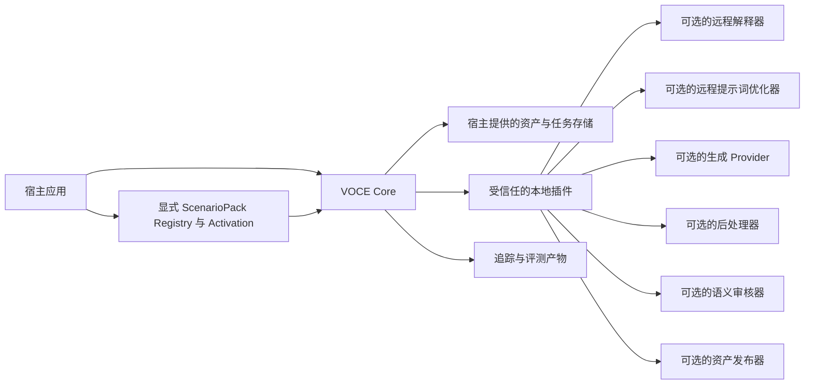
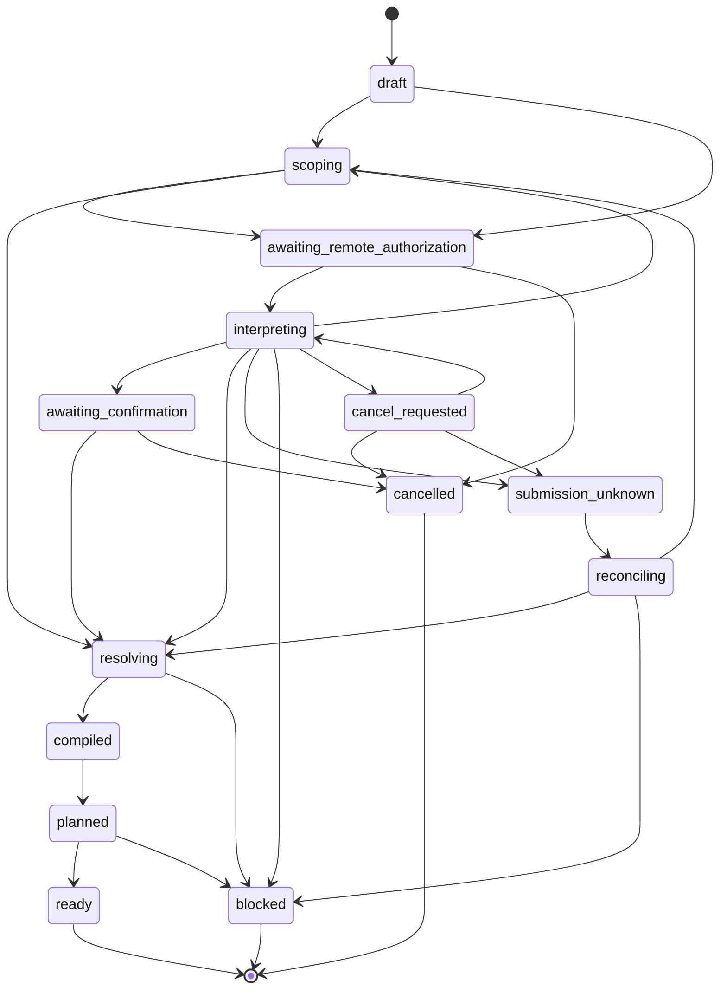
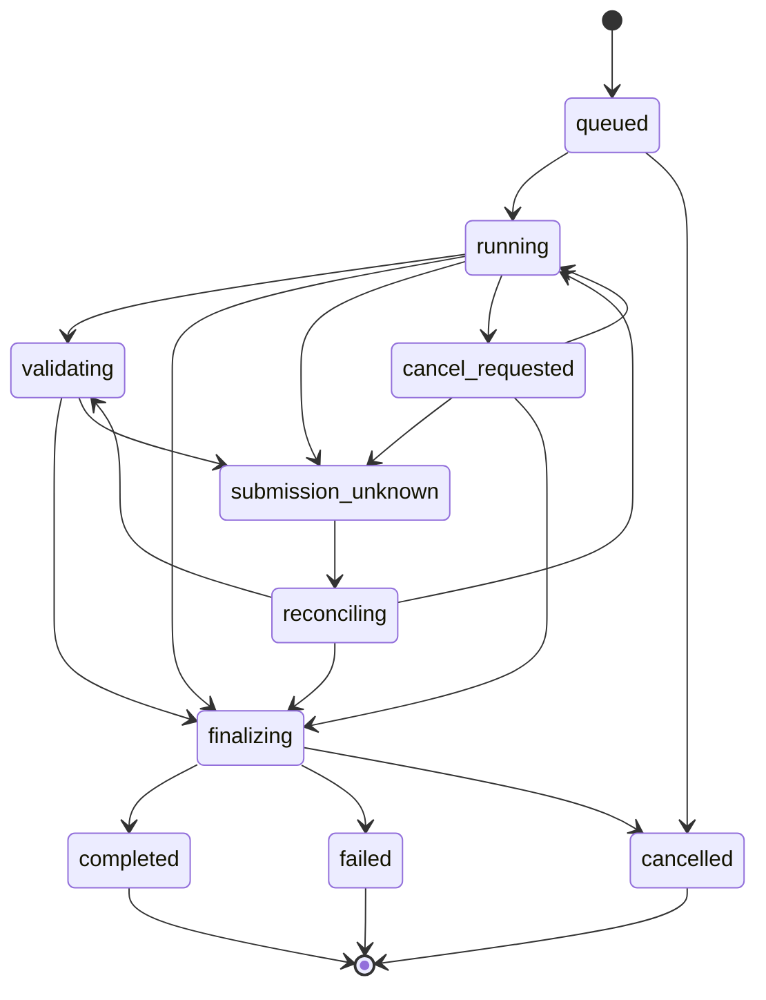

# 系统设计

[返回英文版](../system-design.md)
[项目术语表](glossary.md) · [ScenarioPack 合同](scenario-pack-contract.md)

**状态：** v0.1 提案

**规范源：** 英文版

**翻译地位：** 本文是与英文规范同步维护的一等中文译文；如两者存在无法消除的语义差异，以英文版为准

**系统名称：** Visual Ontology & Constraint Engine（VOCE）

## 1. 目的

VOCE 将自然语言意图、参考图、可信元数据和领域规则转换成一份面向参考图引导图像生成、可执行、可解释且可重放的计划。

本系统解决的是语义编排问题，而不是传输问题。它负责确定：

- 用户希望保留、替换、调整、创建或移除什么；
- 每张参考图可以为当前任务提供什么；
- 哪些观察项已被接受、拒绝或仍待裁决；
- 在产生费用的生成调用之前，哪些约束存在冲突；
- 在不破坏依赖关系的前提下，哪些参考图符合 Provider 的限制；
- 输出契约可以直接达成，还是需要间接达成；
- 如何在不丢失硬约束的情况下优化 Provider-neutral 提示词；
- 哪些内容可以自动验证，哪些内容仍需人工审核。

## 2. 目标与非目标

### 2.1 目标

- 提供领域知识丰富的视觉本体，同时让每个任务实例保持稀疏且有证据支撑。
- 支持一张参考图向多个本体范围提供证据。
- 将概率性解释与确定性的接受、编译和规划分离。
- 将用户的变更意图与证据来源关系分离。
- 从已确认输入生成确定性的中间产物、追踪记录和计划签名。
- 在执行前，根据 Provider 能力、数据可达性、成本、超时和输出契约进行规划。
- 通过变更集和硬约束覆盖情况，让提示词优化过程可检查。
- 支持离线 manual、fixture、compile、explain、Mock、replay 和 comparison 工作流。
- 为 ScenarioPack、解释器、规则包、优化器、Provider、后处理器、验证器、审核器和资产发布提供扩展端口。

### 2.2 v0.1 的非目标

- 托管式 SaaS、商业创作界面、用户账户系统、商品目录、支付系统或发布平台。
- 物理服装合身度、尺码、垂坠模拟或真实购买效果保证。
- 人脸识别、身份验证，或自动声称两张照片描绘的是同一个自然人。
- 多人物身份关联。
- 像素完全一致的生成重放。
- 分布式多租户队列或不受信任的插件沙箱。
- 让自动语义评分成为身份或商品保真的最终裁决者。
- 视频生成或时序一致性。
- 通用的任意 DAG 工作流引擎。

## 3. 设计不变量

以下不变量具有规范性：

1. `Observation`（观察项）是候选主张，不是已接受事实。
2. 未经已接受的来源决策，参考图中的可见内容不会被继承。
3. 一张图片可以提供多个观察项和来源绑定。
4. 缺失信息保持未知；不会为了完整而填满本体。
5. 用户意图、证据置信度、约束重要性和决策状态是彼此独立的维度。
6. 概率性组件可以提出候选；确定性策略或经授权的人负责接受。
7. 规则包是确定性的，并且不执行网络调用。
8. Provider Adapter 执行已批准的计划；它们不得改变语义意图或增加调用。
9. 提示词覆盖并不能证明生成模型遵守了提示词。
10. 结构验证并不能证明语义保真。
11. 结果未知且可能已经计费的提交，永远不会被自动重试。
12. 标准测试、CI 和示例不执行任何付费调用。
13. 公开追踪记录不包含密钥、图片字节、Base64 载荷、签名 URL 和不受限制的敏感描述。
14. 每次远程调用都会经过预检、显式授权和预算控制，并通过持久化 Run 与脱敏事件留档。
15. Case revision、编译签名、计划哈希、Adapter、目的地、输入哈希或预算发生变化时，对应授权失效。
16. 确定性提示词约束门禁只证明类型化的结构不变量；无法验证的语言绝不会被视为已证明安全。
17. 人工验收独立于技术执行和概率性语义审核。
18. Core 永远不会导入 ScenarioPack 或依据 Scenario ID 分支；第一方和第三方 ScenarioPack 使用相同的 Registry 与组合路径。
19. 安装、发现、解析和 PackActivation 均不授权资产访问、远程调用、Provider 选择、数据传输或费用。

## 4. 系统上下文与信任边界



宿主应用负责身份验证、用户同意、资产权利、持久化、保留、删除、审核策略、凭据、成本授权和用户界面。VOCE 负责公共语义合同、确定性编译、计划验证、安全执行边界和可移植的评测产物。

具体抠图服务、透明主体生产以及宿主舞台合成都属于 v0.1 仓库之外的产品职责。VOCE 只保留由宿主注册可选后处理步骤的提供方无关能力；仓库不内置抠图 Adapter，第一方场景也不要求该能力。

v0.1 可执行插件是在宿主进程中运行的受信任本地代码。插件 Manifest 会披露网络访问、可能产生的费用、数据目的地、输入/输出 Schema、兼容性和脱敏行为。声明式 ScenarioPack 数据通过独立的纯数据 Registry 注册，不属于可执行插件代码；由宿主单独选择的 `RulePackPlugin` 或自定义 Loader 会跨越受信任插件边界，而且绝不是 ScenarioPack 依赖。进程隔离和公共插件市场将延后实现。

## 5. 核心术语

| 术语 | 定义 |
| --- | --- |
| `CaseSpec` | 一个设计会话中经过标准化的用户请求、资产、模式、策略和期望输出 |
| `CompilationContext` | 用于编译和签署 Case revision 的不可变版本、能力快照、允许的 Adapter、目的地和预算 |
| `ScenarioPack` | 对场景词汇、RulePack、Scope、Prompt Section、Review Template、Default 和 Fixture 的声明式版本化组合 |
| `ScenarioPackSelection` | 一个 Case revision 中恰好一个 Root、显式 Extension 和可选的类型化 HostPolicyOverlay |
| `ScenarioCompositionLock` | 为确定性编译选定的精确版本、Digest、依赖解析、顺序和 Override Hash |
| `EffectiveScenario` | 根据 ScenarioCompositionLock 产生的完整已组合贡献集合 |
| `ChangeIntent` | 对结果提出的变更要求：preserve、replace、adjust、create 或 remove |
| `RequestedScopePlan` | 解释器在当前任务中获准且必须分析的本体范围 |
| `Observation` | 模型、元数据或用户针对某项资产提出的观察项候选主张，包含溯源信息和不确定性 |
| `ObservationDecision` | 经授权主体对观察项作出的独立、可审计的接受或拒绝决策 |
| `SourceBinding` | 决定某个本体路径可以保留、复现、借鉴或排除选定证据 |
| `BindingDecision` | proposed、confirmed 或 rejected 状态，以及负责该决策的权限主体 |
| `OntologyInstance` | 用于编译的稀疏、已接受、相关且携带来源信息的事实集合 |
| `ConstraintIR` | Provider-neutral 的约束、目标、冲突、依赖、资源和解释 |
| `ReferencePlan` | 在依赖关系和能力预算约束下选中、排序、省略和阻止的参考图 |
| `PipelinePlan` | 能够满足所请求输出契约、经过批准且有明确上限的步骤 |
| `PromptIR` | 与约束和证据关联的 Provider-neutral 提示词中间表示 |
| `PromptCandidateIR` | 针对特定 `PromptIR` 签名提出的类型化、带来源链接的变换 |
| `RemoteCallAuthorization` | 针对指定远程步骤、输入哈希、Adapter、目的地以及调用/费用上限的不可变授权 |
| `ExecutionAuthorization` | 绑定到一个 Case revision、编译签名和精确 `PipelinePlan` 哈希的不可变授权 |
| `ExecutionRun` | 执行已编译计划的一次经批准尝试 |
| `StepReceipt` | 单个执行步骤中追加式事件和证据的脱敏投影 |
| `ArtifactHandle` | 指向宿主拥有的已存储内容及其可用状态的脱敏引用，绝不包含内容字节或临时 URL |
| `EvaluationReport` | 结构结果、概率性语义发现和人工审核决策 |

## 6. 数据模型

### 6.1 CaseSpec

```ts
interface CaseSpec {
  id: string
  revision: number
  mode: 'manual' | 'assisted' | 'auto'
  scenario: ScenarioPackSelection
  userIntent: string
  assets: ReferenceAsset[]
  trustedMetadata: TrustedMetadata[]
  policies: CasePolicies
  requestedOutput: OutputContract
}
```

`CaseSpec` 是设计输入，不代表已授权调用外部服务。理解授权和生成授权彼此独立。

### 6.2 CompilationContext

规划所依赖的不只是 `CaseSpec`。一次完整编译会接收一个不可变且明确选择的环境：

```ts
interface VersionPin {
  id: string
  version: string
  digest: string
}

interface AdapterBudget {
  adapterId: string
  stepKinds: string[]
  maximumCalls: number
  maximumRetries: number
  timeoutMs: number
  maximumCost?: MoneyLimit
}

interface DataTransferDeclaration {
  adapterId: string
  destination: string
  region?: string
  dataCategories: string[]
  purpose: string
}

interface CompilationContext {
  caseSpecId: string
  caseSpecRevision: number
  caseSpecHash: string
  artifactHashes: string[]
  decisionHashes: string[]
  ontologySchema: VersionPin
  scenarioCompositionLockHash: string
  effectiveScenarioHash: string
  rulePackPlugins: VersionPin[]
  hostPolicy: VersionPin
  adapters: VersionPin[]
  capabilityProfiles: VersionPin[]
  selectedGenerationProfileId: string
  optimizer: VersionPin
  optimizerMode: 'strict' | 'balanced' | 'creative'
  budgets: AdapterBudget[]
  dataTransfers: DataTransferDeclaration[]
  contextHash: string
}
```

该上下文会固定精确的 Scenario 组合，以及所有可能改变确定性结果的规则、策略、Adapter、优化器和能力输入。安装另一个 Pack 或插件、改变 PackActivation 或刷新 Capability Profile，绝不会静默改变已有上下文。

`contextHash` 根据其他 Context 字段计算，绝不包含自身。确定性签名使用 `CaseSpec`、已确认决策和所引用 `CompilationContext` 的规范化语义投影。时间戳、Run ID、可用性探测、回执字段以及其他易变值不会进入签名。

### 6.3 ChangeIntent 与重要性

```ts
interface ChangeIntent {
  id: string
  operation: 'preserve' | 'replace' | 'adjust' | 'create' | 'remove'
  targetPath: string
  requestedValue?: unknown
  sourceHintIds?: string[]
  importance: 'hard' | 'required' | 'preferred'
  provenance: Provenance
}
```

`remove` 表示目标结果中不得包含某个实体或属性。这与排除某个来源观察项不同。例如：

```text
ChangeIntent remove accessories.earrings
SourceBinding exclude ref-01/accessories.earrings
```

第一行约束输出；第二行阻止某张参考图提供该属性。

重要性具有以下规范性执行语义：

- `hard`：未满足或发生冲突时阻止执行；不能在原地豁免；
- `required`：未满足时阻止执行，直到经授权的人在新的 Case revision 中创建显式豁免或变更后的要求；
- `preferred`：确定性策略可以将其降级，但必须记录原因、受影响目标和规则追踪。

置信度绝不会改变重要性。豁免绝不会修改原始要求。

### 6.4 RequestedScopePlan

意图理解器（Intent Interpreter）在详细视觉理解之前运行。它根据用户请求、场景策略、资产提示和输出契约推导最小相关范围。

```ts
interface RequestedScopePlan {
  scopes: Array<{
    ontologyPath: string
    assetIds: string[]
    purpose: 'resolve_change' | 'find_source' | 'detect_conflict' | 'validate_dependency'
    required: boolean
  }>
  excludedScopes: string[]
  questions: ClarificationQuestion[]
}
```

元数据检查可以并行运行，但成本较高的视觉分析受此计划约束。这样可以避免穷举式、侵犯隐私的图片描述。

### 6.5 ArtifactHandle 与 EvidenceRegion

敏感内容保留在宿主拥有的存储中：

```ts
interface ArtifactHandle {
  id: string
  storeId: string
  contentHash: string
  mediaType: string
  byteLength?: number
  role: string
  resolverId: string
  availability: 'available' | 'deleted' | 'expired' | 'unknown'
  retentionClass: string
  retentionExpiresAt?: string
  redactionPolicy: string
}

type EvidenceRegion =
  | { kind: 'rectangle'; x: number; y: number; width: number; height: number }
  | { kind: 'polygon'; points: Array<{ x: number; y: number }> }
  | { kind: 'mask'; maskArtifactId: string }
```

坐标采用归一化表示。公开追踪记录包含安全 Handle 和内容哈希，不包含字节、Base64、存储凭据或临时 URL。Mask Handle 遵循与其他敏感产物相同的保留与披露规则。

### 6.6 Observation 与 ObservationDecision

```ts
interface Observation {
  id: string
  contentHash: string
  assetId: string
  ontologyPath: string
  value: unknown
  confidence?: number
  evidenceRegion?: EvidenceRegion
  provenance: Provenance
  analyzer?: {
    adapterId: string
    model: string
    promptVersion: string
  }
  warnings: string[]
}

interface ObservationDecision {
  decisionId: string
  decisionHash: string
  observationId: string
  observationHash: string
  contextHash: string
  status: 'proposed' | 'confirmed' | 'rejected'
  authority: 'user' | 'host_policy' | 'trusted_metadata' | 'auto_policy'
  decidedBy: string
  policyVersion?: string
  decidedAt: string
  reasonCode: string
}
```

绝不能将以下三个彼此独立的维度合并：

- `confidence`：关于某个观察项的认知不确定性；
- `importance`：用户对结果属性的要求有多强；
- `decisionStatus`：独立的授权决策是否接受了候选结果。

高置信度观察项不会自动成为硬约束。用户的硬性要求也不能证明图片观察项一定正确。

`Observation` 是不可变的候选证据。它的 `contentHash` 根据规范化 Observation Payload 计算，并排除 Decision。Analyzer 不能将自己的输出标为 confirmed。接受状态通过与精确 `observationHash` 和 `contextHash` 绑定的 `ObservationDecision` 记录，并包含权限主体、原因以及适用时的策略版本。`decisionHash` 覆盖 Decision 的全部其他字段并排除自身。候选或 Context 发生变化会使旧 Decision 失效。

### 6.7 SourceBinding 与 BindingDecision

```ts
interface SourceBinding {
  id: string
  contentHash: string
  targetPath: string
  observationIds: string[]
  relation: 'preserve' | 'reproduce' | 'inspire' | 'exclude'
  priority: 'hard' | 'required' | 'preferred'
}

interface BindingDecision {
  decisionId: string
  decisionHash: string
  bindingId: string
  bindingHash: string
  contextHash: string
  status: 'proposed' | 'confirmed' | 'rejected'
  authority: 'user' | 'host_policy' | 'trusted_metadata' | 'auto_policy'
  decidedBy: string
  policyVersion?: string
  decidedAt?: string
  reasonCode: string
}
```

`replace` 是变更操作；`reproduce` 是来源关系。一个请求可以替换原夹克，并从 `ref-02` 复现替换用的夹克。

只有 confirmed 的 `BindingDecision` 才能允许绑定进入 `OntologyInstance`。`bindingHash` 覆盖不可变 `SourceBinding`；`decisionHash` 覆盖 Decision 全部其他字段并排除自身。Binding 或 Context 变化会让旧 Decision 失效。确认 Observation 表示接受候选主张；另行确认 Binding 则决定该证据是否可以提供给目标。

### 6.8 稀疏 OntologyInstance

```ts
interface OntologyFact {
  path: string
  value: unknown
  provenance: Provenance
  acceptedBy: string
  sourceBindingIds: string[]
}

interface OntologyInstance {
  schemaVersion: string
  facts: OntologyFact[]
  unknownPaths: string[]
  unresolvedItems: UnresolvedItem[]
}
```

该词汇可以表达人物外观、表情、视线、姿势、衣着、饰品、道具、环境、镜头、灯光、风格、参考图和输出。一个任务实例只包含当前计划所需的已接受事实。

### 6.9 溯源信息（Provenance）

```ts
interface Provenance {
  source:
    | 'user_explicit'
    | 'user_confirmed'
    | 'trusted_metadata'
    | 'reference_observed'
    | 'rule_inferred'
    | 'optimizer_suggested'
    | 'declared_default'
  sourceIds: string[]
  createdBy: string
  createdAt: string
}
```

接受优先级为：

```text
user confirmation
> explicit user intent
> trusted structured metadata
> confirmed image observation
> deterministic rule inference
> model suggestion
> declared default
```

优先级用于选择权限来源，不会抹去意见分歧。冲突会保留在决策追踪中。

### 6.10 远程调用与执行授权

每次远程或可能产生费用的调用，都会在持久化 Run 排队之前，针对不可变输入获得授权：

```ts
interface RemoteCallAuthorization {
  id: string
  caseId: string
  caseRevision: number
  contextHash: string
  stepId: string
  purpose:
    | 'intent_interpretation'
    | 'reference_interpretation'
    | 'prompt_optimization'
    | 'generation'
    | 'postprocessing'
    | 'semantic_review'
    | 'asset_publication'
  inputHash: string
  permittedArtifactHashes: string[]
  permittedScopeIds: string[]
  modelId?: string
  modelVersion?: string
  adapterId: string
  adapterDigest: string
  destination: string
  region?: string
  dataCategories: string[]
  maximumCalls: number
  maximumRetries: number
  maximumBytes?: number
  timeoutMs: number
  maximumCost?: MoneyLimit
  idempotencyKey: string
  authorizedBy: string
  authorizedAt: string
  expiresAt?: string
}

interface ExecutionAuthorization {
  id: string
  caseId: string
  caseRevision: number
  contextHash: string
  compilationSignature: string
  pipelinePlanHash: string
  promptArtifactHash: string
  adapterProfileDigests: string[]
  dataTransferDigest: string
  budgetDigest: string
  remoteCallAuthorizationIds: string[]
  authorizedBy: string
  authorizedAt: string
  expiresAt?: string
}

interface RemoteCallRun {
  id: string
  authorizationId: string
  inputHash: string
  state:
    | 'queued'
    | 'running'
    | 'cancel_requested'
    | 'submission_unknown'
    | 'reconciling'
    | 'succeeded'
    | 'failed'
    | 'cancelled'
  stepReceiptId: string
}
```

Context、计划、Prompt Artifact、Adapter/Profile Digest、目的地声明、输入哈希或预算任一发生变化时，适用授权即失效。`inputHash` 是精确类型化步骤输入的规范化哈希，覆盖全部获准 Artifact Hash、Scope ID、Purpose、Model Identity/Version 与 Adapter Digest；冗余显式字段必须与该投影一致。系统绝不会仅因凭据存在而推断已授权。创建另一次远程提交的重试必须仍有明确的剩余重试权限；只要前一次提交结果未知，重试即被禁止。

## 7. 视觉本体模块

公共词汇采用模块化设计：

- `person`：任务级主体连续性、外观、面部、皮肤、头发和可变换区域；
- `expression`：情绪、强度、眼睛、眉毛、嘴部、视线和头部角度；
- `pose`：身体朝向、四肢、手、手指、重心、动作以及共享/独占资源；
- `wardrobe`：槽位、层次、覆盖、轮廓、材质、颜色和商品保真；
- `accessory`：佩戴区域、左右侧、可见性、遮挡和细节证据；
- `prop`：手持、穿戴、携带或放置的物体及资源声明；
- `environment`：透明、纯色、影棚或场景背景，以及地点、时间、天气和景深层次；
- `camera`：景别、视角、角度、镜头表达、裁切、构图和景深；
- `lighting`：主光、辅光、轮廓光、方向、柔和度、色温和氛围；
- `style`：渲染处理、色彩处理和质感，但不得覆盖身份或保真的硬性要求；
- `output`：尺寸、宽高比、格式、Alpha、背景、字节限制和下游用途。

“人物身份”指任务范围内可识别外观的连续性。它不代表法律身份、生物特征验证、人脸匹配或跨图片自动人物关联。

## 8. 解释流水线

### 8.1 意图理解器（Intent Interpreter）

消费经过标准化的用户文本和场景上下文。产出 `ChangeIntent`、`RequestedScopePlan`、歧义项以及不安全或不受支持的请求。它不会创建已接受的本体事实。

默认的 manual/fixture 路径会离线推导 Scope Plan。如果宿主选择远程 Intent Interpreter，则必须在调用前依据其 Manifest 获得文本传输所需的 `RemoteCallAuthorization`；不能等到后面的生成计划再授权。

### 8.2 参考图理解器（Reference Interpreter）

只消费 `RequestedScopePlan` 允许的资产和范围。产出 `Observation` 观察项记录、待裁决项和警告。

远程 Reference Interpreter 会在 Scope Planning 之后进行预检。其精确资产哈希、范围、目的地、调用/费用上限和 Adapter digest 均绑定进 `RemoteCallAuthorization`；调用以持久化 `RemoteCallRun` 运行，并产生脱敏步骤事件。

它必须：

- 允许每项资产产生多个观察项；
- 返回符合严格 Schema 的输出；
- 在可行时标识证据区域；
- 记录 Adapter、模型和提示词版本；
- 将图片中的文字视为被观察内容，绝不能视为系统指令；
- 避免作出生物识别身份主张；
- 避免将对 Logo、材质或身份的猜测提升为已确认事实。

### 8.3 证据与来源裁决器（Evidence and Source Resolver）

以确定性方式组合 `ChangeIntent`、观察项、可信元数据、此前已确认的决策和宿主策略。它产出：

```text
OntologyInstance
accepted SourceBindings
ObservationDecisions
BindingDecisions
clarification questions
blocking conflicts
unresolved items
decision trace
```

只有当答案会影响硬性/高影响绑定、冲突、输出可行性、外部数据传输或实质性成本时，它才可以提出问题。

### 8.4 交互模式

所有模式最终都汇入相同的 Resolver 和本体合同：

- `manual`：由宿主或用户提供观察项，以及明确的 Observation 和 Binding 决策；不调用理解模型；
- `assisted`：模型提出 Observation，Resolver 产出 Binding Proposal，高影响或低置信度决策等待确认；
- `auto`：策略可以接受低风险候选，但身份、商品保真、权利和硬冲突门禁仍然有效。

`auto` 是由策略控制的实验性自动化，不是对模型的无限授权。

## 9. 约束编译

约束图编译器（Constraint Graph Compiler）将已接受的本体事实、变更意图、来源绑定、输出要求和规则包转换为 `ConstraintIR`。

约束类型包括：

- 保留与变换；
- 可见性和最小证据；
- 覆盖与遮挡；
- 空间放置与构图；
- 互斥与兼容；
- 依赖与基数；
- 共享与独占资源声明；
- Provider 与输出要求；
- 语义审核要求。

输出：

```ts
interface ConstraintIR {
  constraints: Constraint[]
  goals: Goal[]
  conflicts: Conflict[]
  degradedPreferences: Degradation[]
  manualReviewTasks: ReviewTask[]
  ruleTrace: RuleTrace[]
  deterministicSignature: string
}
```

当 `hard` 冲突阻止生成时，Compiler 返回最小可解释冲突集。未满足的 `required` 约束同样会阻止执行，直到新的 Revision 包含显式授权的豁免；只有 `preferred` 约束可以自动降级并进入 Trace。Compiler 不调用模型。

规则包是经过版本管理、确定性、无副作用的模块。它们可以引入本体词汇、解释范围、约束、提示词段落、解释文本和语义审核模板。

## 10. 参考图规划

Reference Budget Optimizer 在不破坏语义依赖的情况下选择 Provider 输入。

输入：

- 已确认的 Observation 与 Binding 决策及其依赖；
- 规范性 `hard`、`required` 和 `preferred` 重要性；
- 父子关系，例如商品主参考图/细节参考图；
- 固定版本的信息覆盖和重复信号；
- 所选且固定版本的 Provider Profile 中的数量、单图字节数、总字节数、格式和顺序限制。

输出：

- 选中的参考图及为其分配的稳定标签；
- 带原因代码的已省略参考图；
- 被阻止的必需参考图；
- 总预算使用情况；
- 依赖关系与排序追踪。

Optimizer 只能根据已声明策略省略 `preferred` 证据。未满足的 `hard` 或 `required` 证据会阻止计划；只有在显式豁免创建了新的 Case revision 之后，`required` 才能继续。Optimizer 不得保留缺少父项的细节图、将商品上身示例用作人物身份来源，或在提示词编译之后重新排序输入。

## 11. 能力与流水线规划

`ProviderCapabilityProfile` 描述经过观察或合同声明的能力，包括：

- 输入模态和来源类型；
- 参考图数量、大小、顺序和依赖行为；
- 提示词和输出限制；
- 尺寸、格式、Alpha 和背景支持；
- 生成/编辑能力；
- 超时和流式传输行为；
- 已知不兼容项；
- 验证状态和证据日期。

能力感知执行流水线规划器（Capability-aware Pipeline Planner）将目标 `OutputContract`（输出契约）与已注册步骤进行匹配。计划可以包括：

```text
resolve provider-readable assets
generate source image
publish a short-lived signed asset when required
run an explicitly registered optional postprocess
normalize canvas
validate structure
prepare semantic review
run mandatory temporary-asset cleanup
```

Planner 产出一份有明确上限的无环主计划，以及显式的 finally/compensation 义务。每个 Adapter Step 都会声明最大调用次数、重试、超时、已知时的最大费用、数据类别、目的地，以及是否可能产生计费提交。Cleanup Step 声明 `always`、`on_success` 或 `on_failure_or_cancel` 条件，并在成功、失败、取消或提交结果未知之后于安全时运行。

`PipelinePlan` 对其 Step、依赖、条件、Adapter/Profile digest、预算、数据传输和清理义务计算规范化哈希。只有 `ExecutionAuthorization` 包含该精确哈希时，计划才可执行。

如果契约不可达，规划会在该计划所治理的任何生成或后处理调用之前失败。此前已经授权的理解回执仍然保留为真实历史。Adapter 不得声称所选 Profile 中不存在的能力。

## 12. 提示词编译与优化

### 12.1 提示词中间表示（Prompt IR）

确定性提示词编译器（Prompt Compiler）将已接受事实和约束转换成 Provider-neutral 结构化段落：

```ts
interface PromptIR {
  sections: Array<{
    id: string
    priority: number
    content: string
    constraintIds: string[]
    sourceIds: string[]
    mutability: 'locked' | 'rephraseable' | 'suggestion_slot'
  }>
  forbidden: PromptProhibition[]
  references: PlannedReference[]
  allowedParameters: ProviderParameterConstraint[]
  output: OutputContract
  deterministicSignature: string
}
```

每条硬约束都由 `locked` Section 或类型化、经过验证的请求参数表示。确定性 Renderer 无需 LLM，即可直接从 `PromptIR` 生成 Provider Prompt。

### 12.2 提示词优化器与 PromptCandidateIR

Optimizer 不会将一段无结构的替换 Prompt 作为权威结果返回。它针对精确 Base Signature 提出类型化变换：

```ts
type PromptTransformation =
  | { kind: 'rephrase'; sectionId: string; content: string }
  | { kind: 'reorder'; sectionIds: string[] }
  | { kind: 'omit_redundant'; sectionId: string; reasonCode: string }
  | { kind: 'set_parameter'; name: string; value: unknown }
  | {
      kind: 'add_suggestion'
      slotId: string
      content: string
      provenance: Provenance
    }

interface PromptCandidateIR {
  candidateHash: string
  basePromptIRSignature: string
  targetAdapter: VersionPin
  targetCapabilityProfile: VersionPin
  transformations: PromptTransformation[]
  candidateSections: PromptIR['sections']
  requestParameters: Record<string, unknown>
  referenceMappings: PlannedReference[]
  coverageClaims: Array<{ constraintId: string; transformationIndexes: number[] }>
  optimizer: VersionPin
  mode: 'strict' | 'balanced' | 'creative'
  warnings: string[]
}
```

`candidateHash` 以规范化形式覆盖 `PromptCandidateIR` 的全部其他字段并排除自身。Target Adapter/Profile、Rendered Section、Parameter、Reference Mapping、Coverage Claim、Transformation、Optimizer、Mode 或 Warning 发生变化时都会产生新 Candidate。

模式：

- `strict`：locked Section 保持不变，不添加 Suggestion，只允许白名单内的参数化或重新排序；
- `balanced`：只能在已声明的 Suggestion Slot 中提出镜头、灯光和构图，并携带 `optimizer_suggested` 溯源信息；
- `creative`：只能在已声明的 Suggestion Slot 中扩展氛围和艺术处理，不得改变 locked Section、参考图或输出要求。

离线确定性提示词优化器是 CI 基线。LLM 提示词优化器是可选、外部、可能产生费用的组件，需要通过 `RemoteCallAuthorization` 单独授权，并作为持久化 Remote Step 执行。即使它提供了 ID，其输出也只是通过 Schema 校验，不会因此受到信任。

### 12.3 提示词约束门禁（Prompt Guard）

确定性 Guard 会将每项 Transformation 应用到 `PromptIR`，且只证明可机械验证的属性：

- Base Signature 匹配；
- locked Section 和硬约束参数保持不变；
- rephrase 和 omission 只针对允许此类操作的 Section；
- Reference ID、顺序、SourceBinding 和输出要求仍然获得批准；
- 参数变更符合类型化白名单；
- 新增内容只出现在允许的 Suggestion Slot 中，并保留 `optimizer_suggested` 溯源信息。

任意自由文本、未链接的 Section，或者语义安全无法证明的 Transformation 均为 `unverifiable`。策略必须将其送交审核，或丢弃 Candidate 并渲染确定性 `PromptIR` Fallback。Guard 不声称能够检测任意 prose 中的全部语义矛盾，也不证明模型遵守 Prompt。

只有通过 Guard 的 Candidate 才会渲染成最终 Provider Prompt 和类型化请求参数。渲染产物、Candidate、Guard Report 和确定性 Fallback 会分别保存。

如果 Provider 返回 `providerRevisedPrompt`，VOCE 会将其记录为独立的 Provider 产物。它不会覆盖 `PromptIR` 或 Optimizer 结果。

## 13. 生命周期与状态机

设计/编译、远程分析调用、已批准的计划执行和人工验收是独立对象。每次远程调用都有持久化 `RemoteCallRun`，即使它发生在编译期间。

### 13.1 CompilationSession



状态：

```text
draft
scoping
awaiting_remote_authorization
interpreting
awaiting_confirmation
resolving
compiled
planned
ready
blocked
cancel_requested
submission_unknown
reconciling
cancelled
```

`ready` 表示执行可行；它不代表已授权执行。远程 Intent/Reference 调用会把持久化 `RemoteCallRun` 的状态投影到 Session。`submission_unknown` 不是终态：Reconciliation 会恢复已有结果，或记录已知的 blocked/cancelled 结果。Reconciliation 绝不会自动重新提交。

### 13.2 ExecutionRun



只有未过期的 `ExecutionAuthorization` 中的 Revision、Context Hash、编译签名、计划哈希、Prompt Artifact Hash、Adapter/Profile Digest、目的地和预算仍然匹配时，才能创建 `ExecutionRun`。

`submission_unknown` 表示远程请求可能已被接受或计费，但 Runtime 没有收到可靠确认。它总会进入显式 `reconciling`，并且永远不会被自动重试。Reconciliation 可以查询已有 Provider Request、附加恢复的结果，或确定一个已知 Failure；新提交属于另行授权的 Run。

`cancel_requested` 记录的是意图，而不是已经取消。如果 Adapter 无法安全停止进行中的调用，Run 会继续，或进入 `submission_unknown`。`finalizing` 会在进入终态前执行必需的结构检查，以及所有安全的 finally/compensation 清理义务。

VOCE 不声称能够为任意外部 HTTP Provider 实现 exactly-once 行为。

### 13.3 StepEvent 与 StepReceipt

```text
pending
authorized
submitted
acknowledged
succeeded
failed
cancel_requested
cancelled
skipped
cleanup_pending
cleaned
cleanup_failed
submission_unknown
reconciling
```

状态变化是追加式 `StepEvent` 记录。`StepReceipt` 是这些事件的脱敏投影，而不是对历史记录的可变替换。每个步骤均具有确定性本地幂等键、输入哈希摘要、Authorization ID、Adapter/版本、时间戳、可用时安全的 Provider Request ID、输出哈希摘要、失败代码、可用时的实际费用证据以及清理状态。

只有当已声明条件不满足或上游依赖阻止执行时，`skipped` 才有效。本地幂等键并不意味着外部 Provider 支持 exactly-once 提交。

## 14. 执行运行时

Runtime 只执行绑定到有效 `ExecutionAuthorization` 的精确 `PipelinePlan`，并强制执行：

- 针对 Intent/Reference Interpreter、Prompt Optimizer、Generator、Postprocessor、SemanticReviewer、AssetPublisher 及任何其他 Remote Step 的每 Adapter/每 Step 调用、重试、超时和费用预算；
- 可重试代码白名单，并在此前任一提交结果未知时禁止重试；
- 每个 Remote Step 获得授权的数据类别和目的地；
- 明确的超时和取消行为；
- 步骤顺序与依赖完成要求；
- 在成功、失败、取消或结果不确定之后，于安全时执行 finally/compensation 资产清理；
- 追加式脱敏事件和投影回执；
- 不存在隐藏的备用 Provider；
- 语义失败后不自动重新生成。

v0.1 可以使用本地持久化任务日志和一个 Worker。分布式队列、多租户和全局 exactly-once 交付将延后实现，但公共端口必须允许宿主应用提供自己的 `JobStore` 和 `JobQueue`。

客户端断开不会取消 Run。取消请求首先进入 `cancel_requested`；只有确认停止后才会进入 `cancelled`。否则 Run 会继续，或进入 `submission_unknown` 和 Reconciliation。

## 15. 验证与评测

评测分为三个独立层次：

### 15.1 确定性结构验证

- 媒体签名、解码、尺寸、格式、Alpha、背景和文件大小；
- 参考图预算和调用预算；
- 已规划步骤的完成和清理情况；
- 产物与回执的 Schema 有效性。

### 15.2 概率性语义审核

`SemanticReviewer` 可以针对身份连续性、商品保真、可见性、构图或其他规则包标准，产出包含置信度、证据、模型/版本和警告的审核发现。

这些发现是候选意见，而不是最终决策。

远程 Reviewer 需要自己的 `RemoteCallAuthorization`、Adapter/Step 预算、持久化 Run 和脱敏回执。审核超时或提交结果未知不会触发再次生成。

### 15.3 人工验收

人工可以接受、拒绝或批注审核任务。身份连续性、Logo、材质、物理合理性和艺术可接受度仍然属于可人工审核的主张。

人工验收与 `ExecutionRun` 分开保存，其状态为 `pending`、`accepted`、`rejected` 或 `waived`，并包含 Reviewer、时间戳、原因和 Artifact Hash。因此，技术上 `completed` 的 Run 仍可能存在待处理或被拒绝的人工验收；拒绝不会被改写为执行失败。

真实模型输出不会作为 CI 的像素金标准 Fixture。CI 验证预期本体、约束、参考图计划、流水线计划、提示词约束门禁行为、Mock 回执和报告 Schema。

## 16. 修订、重放与比较

每次编辑都会创建新的 Case revision；若执行，则创建新的 Run。系统记录父级 ID、增量意图、继承/变更/移除的绑定、新计划和 Provider 编辑能力。

Replay 有三种含义：

- `plan replay`：重新编译已确认输入；在版本相同的情况下，确定性 IR、计划和签名应保持一致；
- `artifact replay`：解析仍然 available 的宿主 `ArtifactHandle`，复用已保存的模型产物，不再执行付费调用；
- `live rerun`：提交新的 Provider 调用；这是一次新 Run，不承诺生成像素完全相同。

Artifact Replay 取决于宿主的保留策略。如果必需 Handle 为 `deleted`、`expired`、`unknown` 或无法解析，Replay 会针对受影响的安全 ID 返回 `ARTIFACT_UNAVAILABLE`；它绝不会替换另一项资产，也不会暗示可以恢复已删除字节。

比较报告会对本体事实、来源绑定、约束、参考图选择、提示词中间表示、提示词优化器变更、流水线步骤、回执和评测结果进行 Diff。

## 17. 插件端口

以下是 v0.1 的候选公共扩展面。每项只有在公共 Schema 与兼容 Fixture 同时发布后才会成为兼容性稳定接口：

- `ScenarioPack`
- `ScenarioPackRegistry`
- `DeclarativeRulePackContribution`
- `ProviderAdapter`
- `ProviderCapabilityProfile`
- `ScenarioPackManifest`
- 离线 Testkit

以下公共实现端口在 v0.1 中属于实验性接口。它们仍受相同的权限、隐私、预算和回执规则约束，但次版本可能改变其 API 或 Schema，不作兼容性承诺：

- `IntentInterpreter`
- `ReferenceInterpreter`
- `PromptOptimizer`
- `PostProcessor`
- `StructuralValidator`
- `SemanticReviewer`
- `AssetResolver`
- `AssetPublisher`
- `JobStore`
- `JobQueue`
- `RulePackPlugin`

每个插件 Manifest 声明：

- 插件版本和 Core 兼容版本；
- 输入和输出 Schema 版本；
- 确定性或概率性行为；
- 网络访问和数据目的地；
- 可能产生费用的调用；
- 支持的取消和重试行为；
- 密钥要求；
- 日志脱敏策略。

理解器和优化器提出产物；它们不能修改已确认事实。`DeclarativeRulePackContribution` 是纯数据。`RulePackPlugin` 是单独的实验性可执行插件边界。Provider Adapter 不得改变已批准的参考图顺序、必需输入、输出契约或预算。

选择插件时，其 Manifest Digest 会被快照进 `CompilationContext` 或相应 Authorization。任何执行远程工作的插件，包括 SemanticReviewer 或 AssetPublisher，都遵循与 Generation Adapter 相同的授权、预算、事件、回执、未知提交与 Reconciliation 合同。

ScenarioPack 是声明式数据组合合同，不是可执行插件代码或执行 Adapter。一个 Case 选择一个 Root、显式 Extension 和可选的类型化 `HostPolicyOverlay`；确定性解析会产出 `ScenarioCompositionLock`、`EffectiveScenario` 和 `PackResolutionReport`。第一方 virtual-try-on、cosplay 和 product-shot Pack 与第三方 Pack 使用相同 Registry。Core 不识别它们的 ID。

完整的 Manifest、依赖/冲突、贡献权限、Override、发现、Activation、Migration、卸载、Replay 和验收规则，以 [ScenarioPack 合同](scenario-pack-contract.md)为规范。其 Manifest 是描述性验证元数据，不是不受信任代码的沙箱。安装或注册 Pack 不会授权 `ProviderAdapter`、选择 `ProviderCapabilityProfile` 或创建远程调用权限。

## 18. 安全、隐私与权利

### 18.1 数据最小化

- 只分析 `RequestedScopePlan` 要求的范围。
- 不在追踪记录中保存图片字节、Base64、Embedding 或不受限制的面部描述。
- 外部传输前移除 EXIF，除非明确要求且已披露。
- 默认保存内容哈希、尺寸、MIME 类型、安全 ID 和脱敏摘要。
- 通过宿主拥有且具有显式可用状态的 `ArtifactHandle` 引用保留的敏感内容；追踪记录绝不嵌入存储凭据或直接 Locator。
- 提供最小化本地 Run bundle，以及单独、显式创建的可分享 Bundle。
- 默认不收集遥测。

### 18.2 外部传输

远程调用前，宿主应用需要披露服务、已知时的区域、数据类别、目的、Adapter 可提供的保留信息、最大调用次数、重试、费用和取消限制。这些披露内容会绑定进 `RemoteCallAuthorization`，而不只是作为提示界面显示。

临时公开资产使用短期签名 URL，绝不写入日志，只读，并产生追加式发布与清理事件。发布属于独立预算的 Remote Step；清理属于 finally/compensation 义务。清理失败必须显式报告，不能被其他方面有效的输出掩盖。

外部 URL 解析会限制协议、重定向、DNS/IP 目标、内容类型和字节上限，以降低 SSRF 和资源耗尽风险。

### 18.3 身份与权利

VOCE 不执行身份验证或人物识别。宿主应用负责获得人物图片、商品图片、品牌、角色设计和其他受保护素材的同意与权利，并负责审核和遵守适用法律。

Benchmark 资产必须是合成、原创、公有领域，或得到明确的再分发许可，并记录来源。

### 18.4 密钥

密钥在运行时注入，绝不允许出现在 `CaseSpec`、插件 Manifest、追踪记录、Fixture、截图或公开报告中。缺少凭据时，系统会在创建或提交任务前明确失败。

## 19. 错误与恢复模型

错误使用稳定的英文代码和安全的用户可见消息。类别包括：

```text
INPUT_INVALID
INTERPRETATION_UNAVAILABLE
CONFIRMATION_REQUIRED
CONSTRAINT_CONFLICT
REFERENCE_BUDGET_UNSATISFIABLE
PROVIDER_CAPABILITY_UNSATISFIABLE
REMOTE_CALL_NOT_AUTHORIZED
EXECUTION_NOT_AUTHORIZED
EXECUTION_AUTHORIZATION_INVALID
REMOTE_SUBMISSION_UNKNOWN
PROMPT_CANDIDATE_UNVERIFIABLE
PROVIDER_FAILED
POSTPROCESSING_FAILED
STRUCTURAL_VALIDATION_FAILED
SEMANTIC_REVIEW_REQUIRED
ARTIFACT_UNAVAILABLE
CLEANUP_FAILED
```

任何失败都不会创建空的占位观察项、静默弱化 `hard` 或 `required` 约束、更换 Provider，或重新提交结果未知且可能已经计费的请求。

如果源图生成成功后后处理失败，可以根据宿主策略通过 `ArtifactHandle` 保留源产物和回执。只有在创建新计划或计划 Revision、确认 Artifact 仍然 available，并获得与精确哈希和预算绑定的新授权后，才能仅重试失败步骤。

## 20. 成本授权与回执

Intent/Reference 理解、提示词优化、生成、后处理、语义审核和资产发布都可能产生费用并涉及外部数据传输。Preflight 与 Planning 会分别核算每个远程 Adapter 和 Step。

执行前，宿主应用可以展示：

- 离线与远程步骤；
- 每个 Adapter 和 Step 的最大调用次数、重试、超时和费用；
- 重试与停止条件；
- 可用时的预计费用或已声明上限；
- 超时与取消限制；
- 数据类别、目的地，以及临时公开/清理行为。

批准值会持久化到 `RemoteCallAuthorization`，并且对于最终计划执行，也会持久化到 `ExecutionAuthorization`。可用时，实际调用和 Provider 报告的用量/费用会记录为脱敏回执。预计费用绝不会被改写为实际费用。

## 21. 版本与兼容性

以下产物独立进行版本管理：

- 本体 Schema；
- ScenarioPack Manifest、贡献 Schema、`ScenarioCompositionLock`、`EffectiveScenario`、HostPolicyOverlay、PackActivation 和 Migration 合同；
- `CompilationContext`、Observation/Binding Decision、Authorization 和 `ArtifactHandle` 合同；
- 规则包；
- ConstraintIR、ReferencePlan、PipelinePlan、PromptIR 和 PromptCandidateIR；
- 插件 Manifest 和 Capability Profile；
- Run、Step Event、Receipt 和 Human Acceptance Schema；
- Evaluation Report Schema。

首个公共 Package 发布后采用 Semantic Versioning。任何破坏性公共合同变更都需要迁移说明、兼容性 Fixture 和同步更新的配套文档。

Run 产物会固定所有相关版本，使报告在项目演进后仍然可以被解释。

成对维护的四份核心规范是 `scenario-design`、`system-design`、`glossary` 和 `scenario-pack-contract`。英文是规范源，简体中文作为一等语义译文维护；稳定的 Scenario/Requirement ID、枚举和代码标识符保持同步。Architecture 和 Roadmap 是解释性摘要，不在这一成对翻译保证中，除非它们被明确以成对版本发布。

## 22. v0.1 实现边界

### 22.1 必须实现

- 每个 Case 包含零个或一个主要人物；存在人物时，可以包含多件服装、饰品或道具；
- 稀疏本体、多范围 Observation、`ObservationDecision` 和已确认的 Binding Decision；
- 不可变 `CompilationContext`、`RemoteCallAuthorization` 和与 Plan 绑定的 `ExecutionAuthorization` 合同；
- 确定性 `ScenarioPackRegistry`、Root/Extension/HostPolicyOverlay 解析、精确 `ScenarioCompositionLock` 和 PackActivation 合同；
- 普通离线 `ScenarioPackTemplate`、Validator、发布审计，以及 Migration/Uninstall/Replay 生命周期 Fixture；
- 完整支持 manual 和 fixture 模式；
- assisted 模式配备一个可选的多模态 Adapter；
- experimental auto 策略具有不可绕过的高影响门禁；
- 确定性证据与来源裁决器、约束图编译器、Reference Planner、能力感知执行流水线规划器、提示词编译器和提示词约束门禁；
- 确定性离线提示词优化器，加一个返回受约束 `PromptCandidateIR` 的可选 LLM 优化器；
- Mock-first 执行以及可选 Seedream Adapter 实现；
- 每个 Remote Step 使用本地持久化异步执行，包含持久化事件、Reconciliation、Compensation Cleanup 和 `submission_unknown` 防护；
- CLI 和只读的本地/静态 HTML Trace Report；
- 通过与第三方 Pack 相同公共路径注册的第一方 virtual-try-on、cosplay 和 product-shot ScenarioPack；
- 一个完整的离线 Mock 虚拟试衣纵向 Case、离线 Cosplay 冲突 Case 和离线纯商品回归 Case，并将其作为 Pack 驱动的 Release Gate；
- 可再分发的 Fixture 和离线 CI。

真实 Adapter Smoke Test 是显式启用、需要凭据且不在 CI 中运行的工作流。它们默认不会运行，也不是 `v0.1.0` 的默认 Release Gate。Release 可以发布带日期的 Smoke Evidence，但项目不会据此声称 Production Ready。

### 22.2 延后实现

- 多人物自动关联；
- 物理合身度和材质模拟；
- 身份识别或验证；
- 托管式多租户基础设施；
- 分布式 exactly-once 执行；
- 不受信任插件隔离或插件市场；
- 超出只读 HTML Trace Report 的交互式 Trace Studio；
- 视频生成；
- 让自动语义审核成为最终权威；
- 跨实时模型调用的像素完全一致重放。

## 23. v0.1 验收矩阵

| ID | 要求 |
| --- | --- |
| SYS-001 | 相同的已确认输入和不可变 `CompilationContext` 会产生完全一致的本体、IR、计划和规范化签名；易变的时间戳及 Run/Receipt ID 不会影响这些结果。 |
| SYS-002 | 一张图片可以产生多个不可变 Observation，但只有另行授权的 `ObservationDecision` 和 `BindingDecision` 才能允许证据进入本体。 |
| SYS-003 | 低置信度模型候选不会仅仅因为置信度而成为硬事实。 |
| SYS-004 | preserve/replace/adjust/create/remove 意图始终与 preserve/reproduce/inspire/exclude 来源关系保持分离。 |
| SYS-005 | 可以在生成调用前发现面具/身份、袖子/手链和手/道具冲突。 |
| SYS-006 | 缩减参考图预算时会保留 `hard`/`required` 父子依赖，只省略策略允许的 `preferred` 证据，并解释每个省略项或阻塞要求。 |
| SYS-007 | 提示词约束门禁会拒绝无效的 Base Signature，以及任何对 locked Section、参考图、Binding、输出要求或类型化参数边界的变更；无法验证的自由文本会送审或被丢弃并使用确定性 Fallback。 |
| SYS-008 | 能力规划会在可行时推导有上限的 Step 和 finally/compensation Cleanup，在不可行时于执行前失败，并且只在授权包含精确 Plan Hash 时执行。 |
| SYS-009 | 每次远程调用都有持久化脱敏事件；客户端断开、取消和 Worker 恢复都不会自动重复提交结果未知且可能已经计费的请求，`submission_unknown` 会进入 Reconciliation。 |
| SYS-010 | 可分享追踪记录不包含图片字节、Base64、密钥、签名 URL、存储凭据或不受限制的敏感描述；保留内容只通过安全的 `ArtifactHandle` 元数据表示。 |
| SYS-011 | 纯商品 Case 在主要人物数量为零且不存在隐式人物假设时，通过相同的 Compiler、Planner、Runtime 和 Evaluation。 |
| SYS-012 | manual 模式无需网络访问或凭据，即可执行 compile、explain、plan、Mock-run、replay 和 compare。 |
| SYS-013 | 技术执行/验证、概率性语义发现和人工验收始终保持为独立产物和状态机；人工拒绝不会被改写为技术失败。 |
| SYS-014 | 每个远程 Adapter Step 都通过 Authorization 和 Receipt 声明并强制执行目的地、数据类别、调用、重试、超时、费用、取消、清理和脱敏策略。 |
| SYS-015 | 成对的四份英文/中文核心规范保持 Scenario ID、Requirement ID、枚举和代码标识符同步，并以英文为规范源。 |
| SYS-016 | Core 通过同一 Registry 加载第一方和第三方 ScenarioPack，并且不包含以 Scenario ID 为键的 Import 或分支。 |
| SYS-017 | 相同的 ScenarioPackSelection、不可变 ScenarioPackCatalogSnapshot、HostPolicyOverlay、Resolver 和合同版本会产生完全一致的 ScenarioCompositionLock、EffectiveScenario、PackResolutionReport、顺序和语义 Hash。 |
| SYS-018 | Scenario 组合会固定精确版本和 Digest，并通过解释性 Trace 阻止缺失依赖、不兼容范围、Digest 不匹配、已声明冲突、重复贡献冲突和顺序环。 |
| SYS-019 | Ontology、DeclarativeRulePackContribution、Scope、Prompt、Review、Default、OverridePoint、FixtureSuite、UIMetadata、Capability Requirement 和 Declaration 贡献始终处于 ScenarioPack 权限边界内。 |
| SYS-020 | ScenarioPack 不能执行网络或 Provider 调用、读取 Secret、修改已确认事实、创建 Authorization、改变预算或目的地、覆盖 Host Policy，或绕过 Guard 与 Review Gate。 |
| SYS-021 | Discovery 使用显式本地来源；安装、发布或注册绝不意味着 PackActivation、远程访问、Provider 选择、数据传输、费用授权、Marketplace 查询、动态扫描或自动下载。 |
| SYS-022 | 普通 ScenarioPackTemplate 与发布审计不授予 Runtime 权限；virtual try-on、cosplay 与 product-shot 作为 Pack，通过相同 Compiler、Planner、Runtime 和 Evaluation Pipeline 完成各自的离线 FixtureSuite。 |

## 24. 构图提示词闭环

首批构图纵向闭环使用现有的 `camera` 本体模块。规范公共词汇和 30 个选择器预设位于 [`fixtures/shared/visual-composition.v1.json`](../../fixtures/shared/visual-composition.v1.json)；预设会展开为原子 `ChangeIntent`，预设 ID 只作为溯源保留。构图卡不是参考资产，不会创建 `SourceBinding`、`PlannedReference`，也不会占用参考图预算。

`OntologyPathDefinition`、`DeclarativeRulePackContribution` 和 `PromptSectionContribution` 是类型化声明式边界。Core 会校验并防御性复制它们，再按 `cardinality=one` 的规范化值分组、显式条件操作符和 hard/required/preferred 处置矩阵运行。失败的偏好会变为 `unsatisfied`，恰好关联一个 `Degradation`，并从有效提示词覆盖中排除。

`PromptCompilationInput.effectiveScenario` 与 `CompilationContext` 绑定 Hash。PromptCompiler 只消费 active 或 satisfied 约束，并在 `PromptIR.excludedConstraints` 中记录每个 unsatisfied 约束。Prompt Guard 会验证排除集合保持不变，并拒绝 excluded ID 通过 Section、Parameter、Mapping、Coverage 或 Transformation Proof 重新进入。Provider 原生构图参数、UI 卡片素材、构图参考资产和真实 Provider 调用仍属后续范围。

| SYS-023 | 构图选择器展开为 camera 所有的原子本体事实；类型化 ScenarioPack 策略确定性处理冲突，Prompt IR 记录排除项，Prompt Guard 拒绝重新链接已排除约束。 |
